# AI 에이전트의 효과적인 활용 - Mermaid 다이어그램 후보

아래는 슬라이드에 Mermaid를 넣는다면 우선 적용할 위치와 초안입니다.
현재 `docs/ai-agent-effective-use/index.html`에는 Mermaid 렌더러와 아래 다이어그램들이 본문에 들어가 있습니다.
렌더러는 Mermaid 공식 문서의 ESM CDN 방식으로 붙였고, 버전은 재현성을 위해 `11.15.0`으로 고정했습니다.

## 1. Slide 3 - AI Agent 구성

목적: "AI Agent = Model + Android Context + Tools + Verification"을 구조로 보여줍니다.

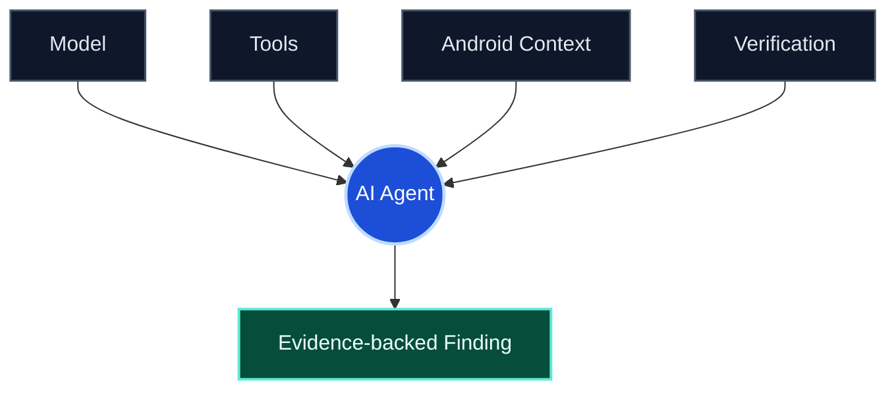

## 2. Slide 5 - 답변은 작업의 시작점

목적: 질의응답만으로는 파일 변경, 실행, 검증, 최신 상태 확인이 되지 않는다는 점을 한 장에 보여줍니다.

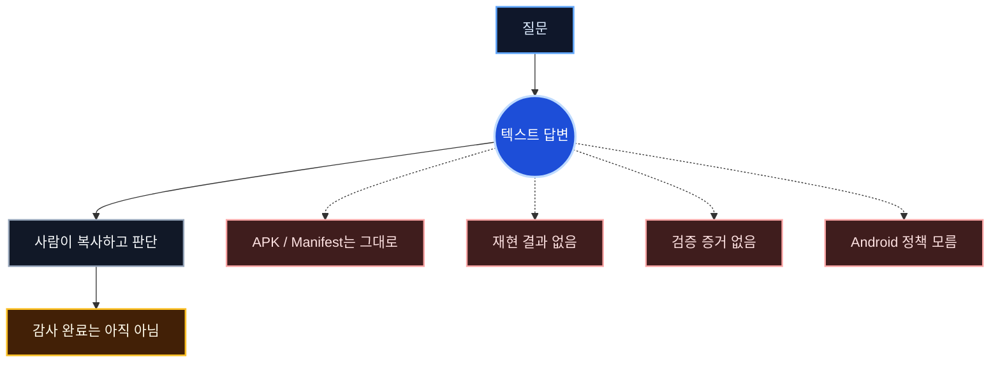

## 3. Slide 8 - Tool Calling

목적: 모델이 도구를 직접 실행하는 것이 아니라, 앱이 실행하고 결과를 다시 모델에 전달한다는 점을 분명히 보여줍니다.

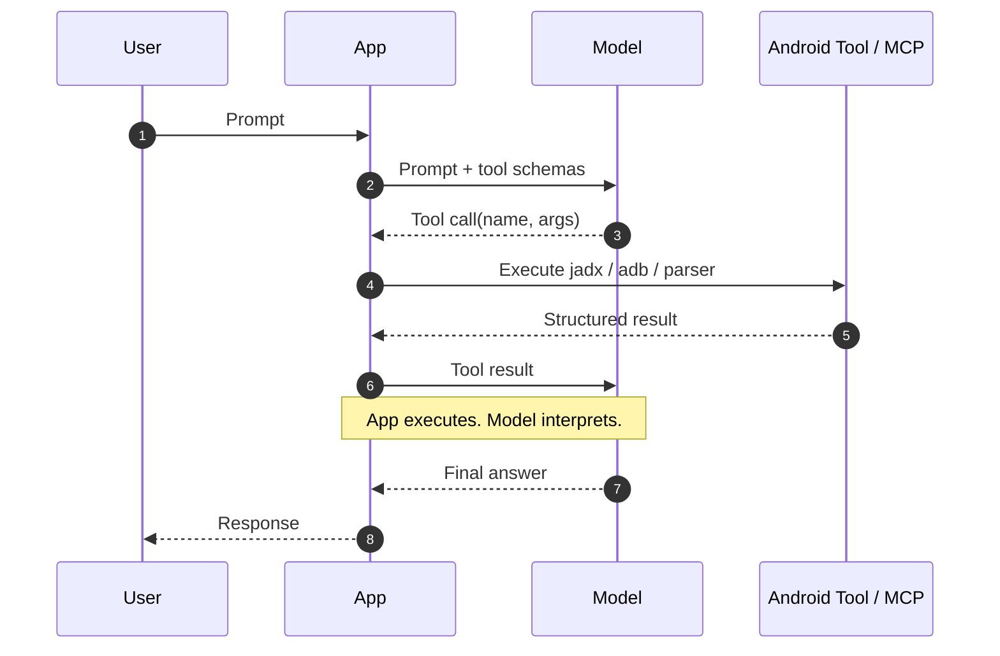

## 4. Slide 11 - MCP 구조

목적: AI model이 tool call을 판단하고, Host가 여러 타입의 MCP client를 통해 여러 타입의 MCP server로 연결한다는 구조를 보여줍니다.

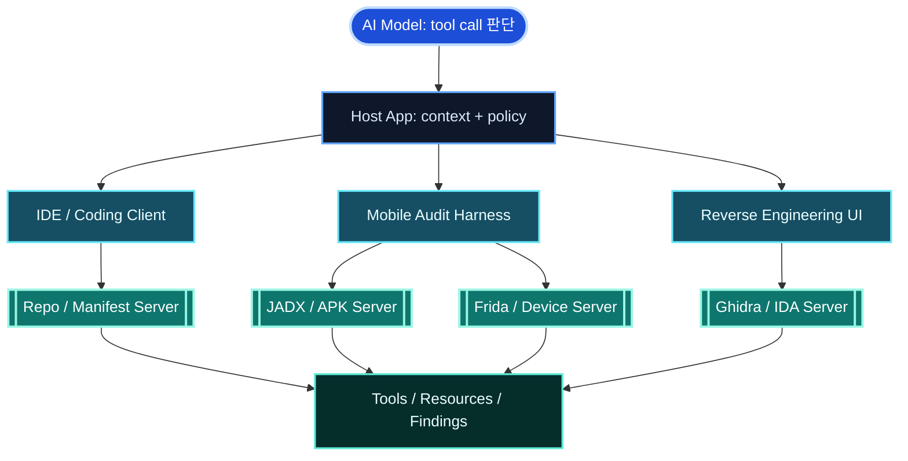

## 5. Slide 12 - MCP 이전과 이후

목적: 커스텀 연동 복잡도와 표준 서버 재사용의 차이를 대비합니다.

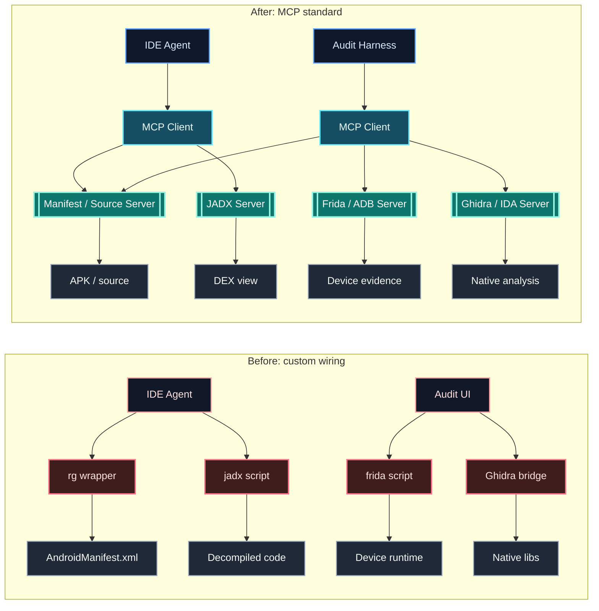

## 5-1. Slide 13 - Filesystem MCP 예시

목적: 대표적인 MCP server인 filesystem이 허용된 workspace 안에서 파일 도구를 실행하는 구조를 보여줍니다.

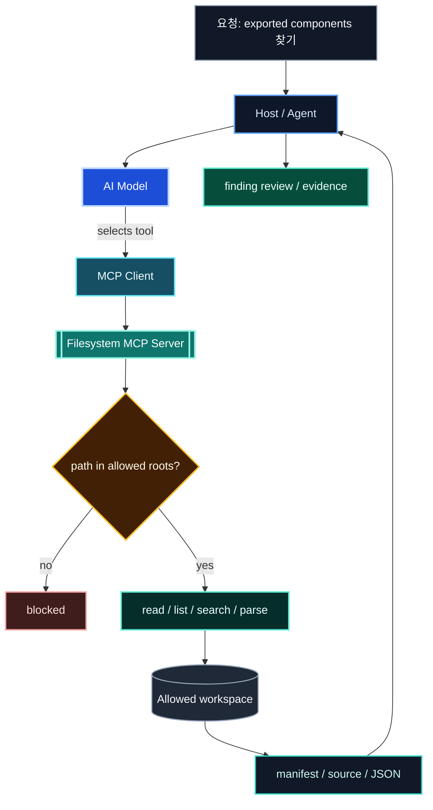

## 6. Slide 16 - Agent Loop

목적: 에이전트가 한 번 답하는 것이 아니라 관찰과 수정 루프를 돈다는 점을 강조합니다.

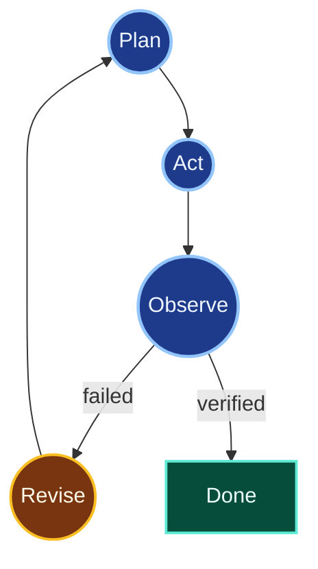

## 7. Slide 18 - 코딩 에이전트 공통 구조

목적: Claude Code, Codex CLI, Gemini CLI, Cursor 같은 코딩 에이전트의 공통 구조를 보여줍니다.

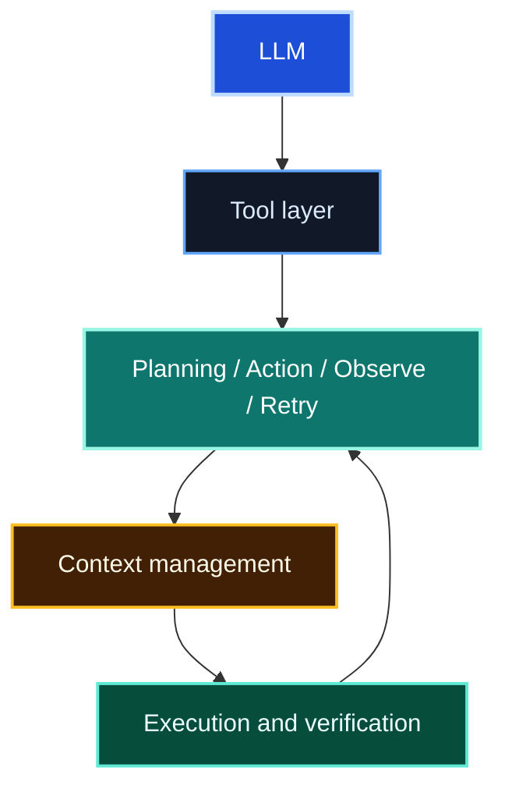

## 8. Slide 33 - Harness 작업 흐름

목적: 사용자 요청이 그대로 실행되는 것이 아니라 audit spec과 도구 정책을 거쳐 추출/판단/검증 루프로 들어간다는 점을 보여줍니다.

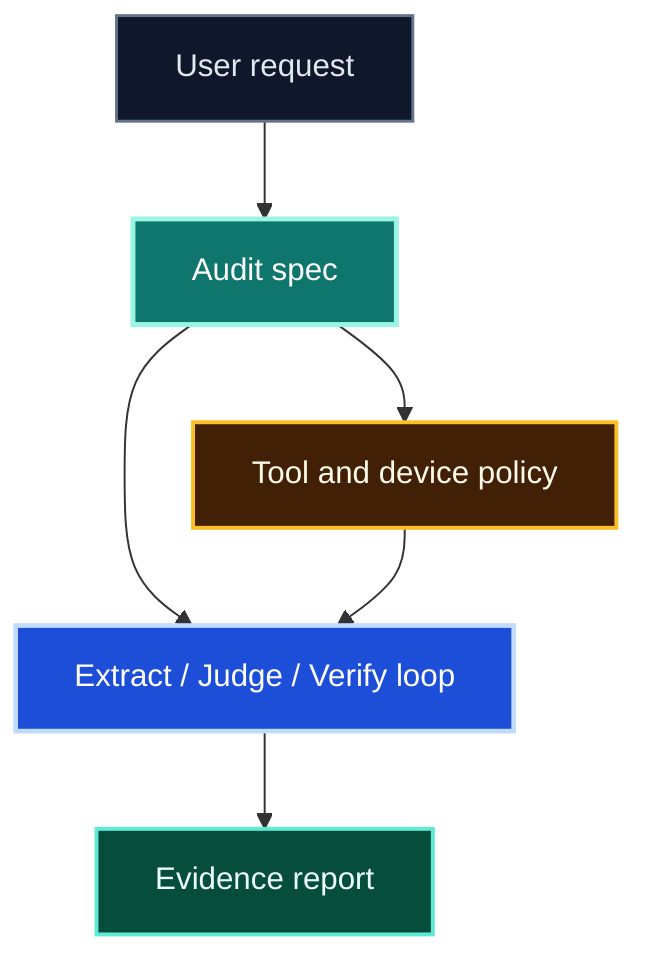

## 9. Slide 37 - 종료 조건

목적: 성공, 알려진 실패, 불명확성, 예산 초과를 다르게 처리하는 종료 정책을 보여줍니다.

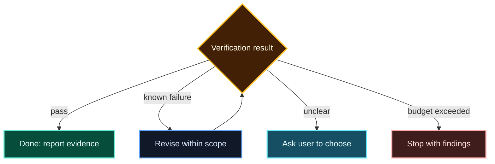

## 10. Slide 26 - 에이전트 작업 방식

목적: 사람이 복사/실행하던 작업이 에이전트 실행 루프로 들어간다는 점을 보여줍니다.

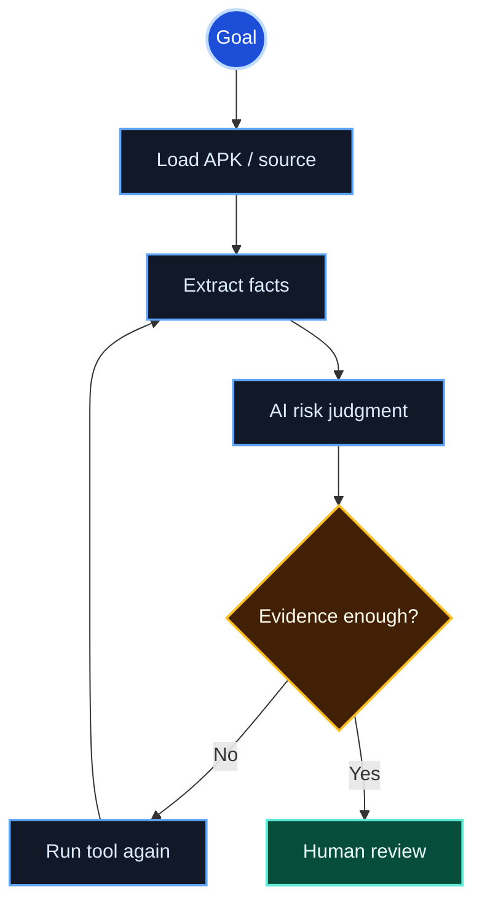

## 11. Slide 27 - Open components 추출 루프

목적: code agent만으로 찾는 방식과 structured extractor를 붙이는 방식의 차이를 보여줍니다.

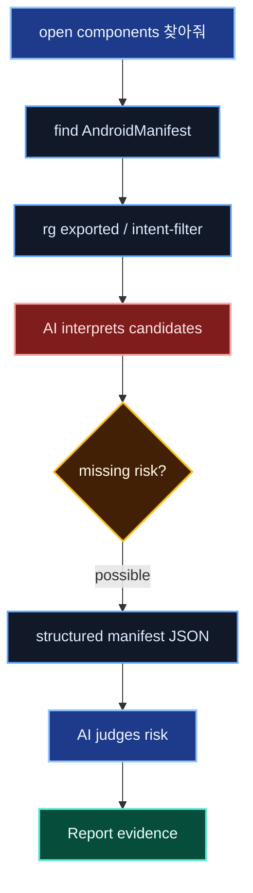

## 12. Slide 31 - 작업 지시의 4요소

목적: 좋은 요청을 구조화된 입력으로 보여줍니다.

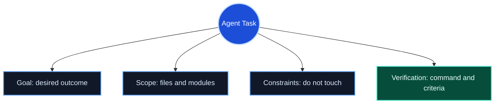

## 13. Slide 37 - Skill progressive disclosure

목적: Skill이 항상 전체 context를 차지하지 않고, 이름/설명에서 시작해 필요한 파일만 단계적으로 로드된다는 점을 보여줍니다.

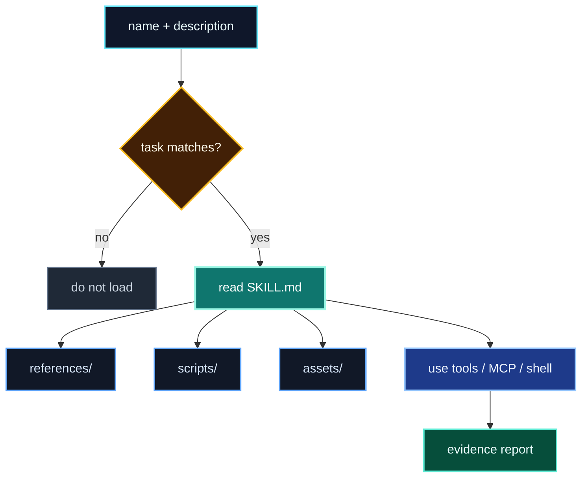

## 14. Slide 43 - 정확도와 토큰 예산

목적: 적은 토큰과 높은 정확도가 요청 구조화, context 선별, 도구 순서, 검증 루프에서 나온다는 점을 보여줍니다.

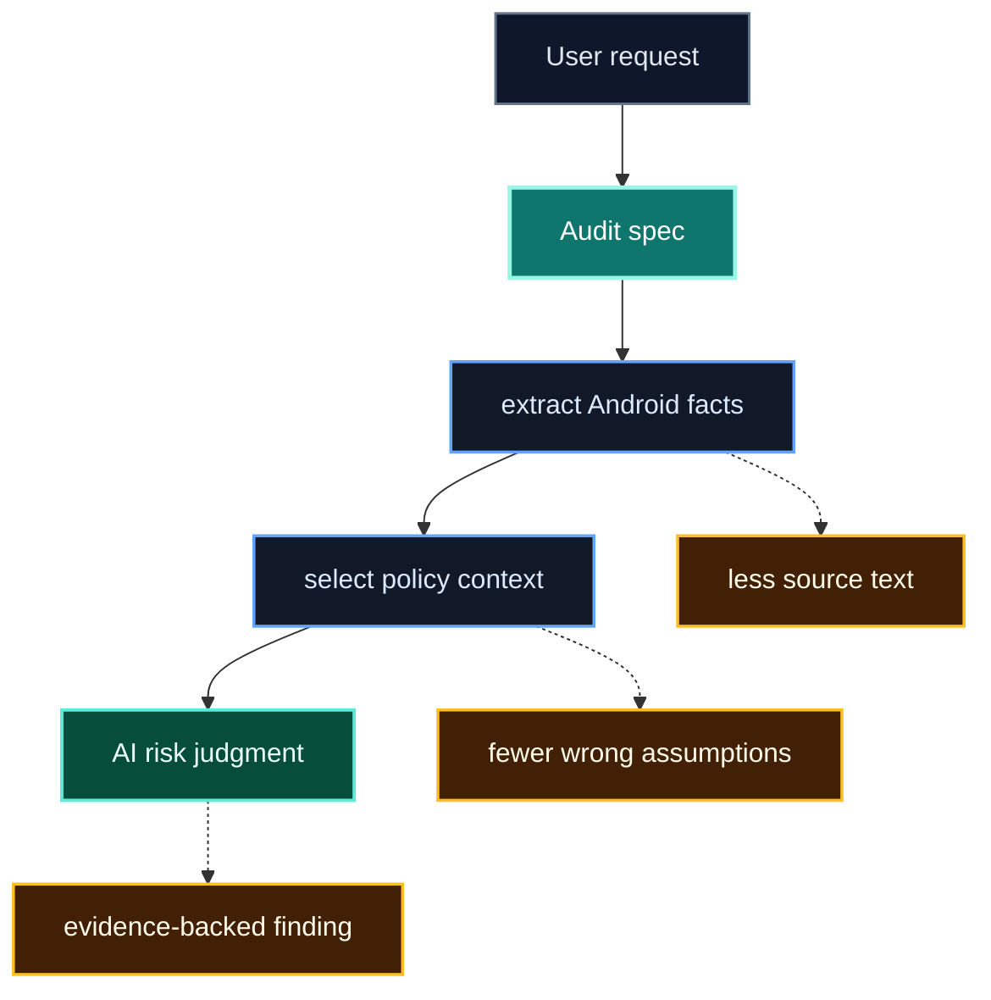

## 15. 모바일 앱 보안 분석 루프

목적: 모바일 앱 취약점 가설이 증거, 수정, 회귀 테스트까지 이어져야 실제 보안 분석 결과가 된다는 점을 보여줍니다.

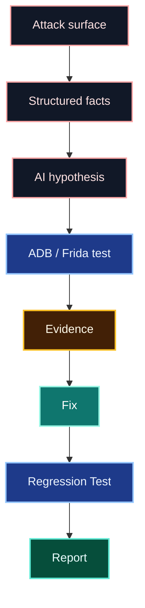
