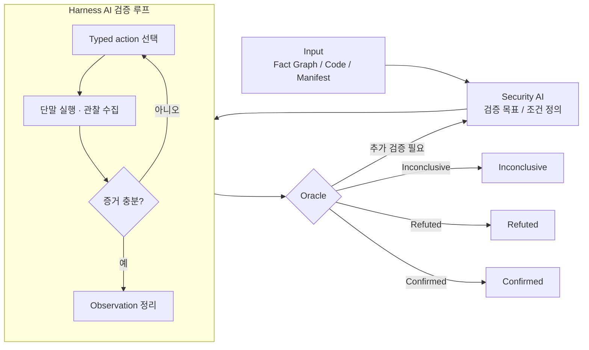

# AI 기반 Android 보안 분석 및 검증 Harness

AI 후보 분석과 단말 기반 검증 루프를 결합한 Android 보안 점검 체계

## Slide 01. 제목

# AI 기반 Android 보안 분석 및 검증 Harness

AI 후보 분석과 단말 기반 검증 루프를 결합한 Android 보안 점검 체계

## Slide 02. 추진 배경 - 보안검토 업무량 증가

핵심 메시지: 보안검토, APK 서명 리뷰, Spot 이슈 분석과 PLM 대응을 빠르게 처리해야 하는 운영 부담 확대

| 항목 | 규모 또는 현황 | 시사점 |
| --- | --- | --- |
| 2025년 보안검토 요청 건수 | 1,045건 | 연간 누적 검토 요청 증가 |
| APK 서명을 위한 리뷰 건수 | 일 평균 약 150건 | 매일 반복되는 서명 전 검토 부담 |
| 다량 분석 대응 | Spot성 이슈 분석, PLM 등 다량의 분석을 빠르게 수행해야 함 | 처리 속도와 우선순위 판단 부담 증가 |
| 수작업 의존 | 후보 선별, 검증 계획 수립, 재현, 보고까지 수작업에 의존 | 일관성과 재현성 저하 |

## Slide 03. 추진 배경 - AI 분석 적용 시 문제점

핵심 메시지: AI는 분석 속도를 높일 수 있으나 보정, 검증, 결과 일관성 측면의 통제가 필요

| 구분 | 주요 현상 | 보안 점검 영향 |
| --- | --- | --- |
| 수작업 보정 필요 | 사람이 AI 분석 결과를 재확인하고 수정해야 하는 경우가 많음 | 자동화 효과 제한 및 검토자 부담 지속 |
| 검증 없는 이슈 확정 | 재현 검증 없이 이슈를 확정하는 경우가 많음 | False Positive 증가 |
| 결과 변동성 | 동일 입력임에도 AI 분석 결과가 다르게 나오는 경우가 많음 | 점검 결과 신뢰성 저하 |

관리 방향: AI 분석 결과는 확정 finding이 아니라 검증 대상 후보로 관리하고, 단말 재현과 evidence 기준을 거쳐 최종 채택해야 함

## Slide 04. 과제 목표

핵심 메시지: AI 기반 빠른 분석과 실단말 검증을 결합해 재현 가능한 보안 점검 체계 구축

| 목표 | 주요 내용 | 기대 결과 |
| --- | --- | --- |
| 빠른 취약점 분석 | AI를 사용해 보안 취약점 후보와 관련 근거를 신속하게 분석 | 분석 초기 속도 개선 |
| 기존 Pain Point 해결 | 낮은 재현성, 과도한 수작업, 높은 False Positive 개선 | 점검 품질과 운영 효율 개선 |
| 재현 가능한 보고 | 실단말 검증 Harness로 검증자가 쉽게 재현 가능한 보고서 작성 | 검증자 재현 부담 감소 |

## Slide 05. Mobile Audit Harness 구성

핵심 메시지: 도구 역할을 분리하고 Harness가 실행, 수집, 상관분석을 일관되게 관리

원본 PNG: [열기](../assets/images/ai-agent-effective-use/mobile-audit-harness.png)

## Slide 06. 관련 조사 및 벤치마킹 검토

핵심 메시지: 기존 자료는 일부 요소만 차용 가능하며, 본 과제 평가 기준으로는 직접 사용하기 어려움

| 조사 대상 | 간단 설명 | 적합성 | 한계 | 차용 가능 포인트 |
| --- | --- | --- | --- | --- |
| COVA | 정적 taint-analysis 경로 조건을 계산/검증하는 연구 | 직접 사용 어려움 | Android taint-analysis 결과의 path constraint 계산/검증용 micro-benchmark로, 단말 조작 -> 취약점 트리거 -> evidence/oracle 판정 목적과 다름 | 정적 분석 단계의 조건 추출 아이디어 |
| AndroidWorld | 실제 Android emulator에서 앱 task를 수행하는 모바일 GUI agent benchmark | 부분 사용 가능 | live Android emulator에서 20개 앱/116개 task를 수행하는 모바일 GUI agent benchmark이나, 보안 취약점·root 조건·system UID·exploit oracle 부재 | Harness AI의 UI 조작 능력 평가 |
| Ghera | 취약 앱, 공격 앱, 수정 앱을 묶은 Android 취약점 benchmark | 부분 사용 가능 | vulnerable/benign, malicious/exploit, secure app 구성이 있어 seed corpus로는 유용하나 2017년대의 작고 lean한 예제 중심 | 취약/정상/공격 앱 seed corpus |
| DroidBench | Android 정보흐름 분석 도구의 정확도 평가용 micro-benchmark | 부분 사용 가능 | Android taint-analysis 도구 평가용 micro-benchmark로, 정보 흐름 검출 중심이며 실제 APK의 component/provider/webview/storage 조합형 검증에는 약함 | 정적 data-flow ground truth 비교 |
| MobSF | 모바일 앱 정적/동적 보안 분석 자동화 framework | 평가 벤치마크 아님 | Android/iOS/Windows mobile app automated security assessment framework이나 AI 분석 기능 및 본 과제용 exploit oracle 제공 없음 | 정적/동적 분석 수집 baseline |

검토 결론: 단말 조작 -> 취약점 트리거 -> evidence/oracle 판정까지 평가하려면 별도 보안 검증 벤치마크와 실제 앱 기반 E2E 케이스 구성이 필요

## Slide 07. 과제 추진 사항 - 추진 방식

핵심 메시지: 결정적 분석 틀을 먼저 고정하고 AI는 후보 생성과 검증 조정에 제한적으로 활용

AI에게 임의 탐색을 맡기기 전에 결정적 분석 틀과 구조화된 evidence를 먼저 제공

원본 PNG: [열기](../assets/images/ai-agent-effective-use/deterministic-vs-free-search.png)

## Slide 08. 과제 추진 사항 - PoC 스크린샷

핵심 메시지: 대상 선택, 분석 단계 진행, findings 확인, 보고서 검토까지의 end-to-end 화면 예시

| 화면 | 설명 |
| --- | --- |
| 대상 패키지 선택 | 분석 job queue에서 대상 APK와 우선 검토 대상을 선택 |
| 분석 구동 상태 확인 | ingest, decompile, manifest, semgrep 등 stage 진행 상태 확인 |
| Findings 상세 검토 | severity, evidence, location, LLM analysis 및 stored output 확인 |
| 분석 완료 보고서 | summary, validation, metadata, permissions, report artifact 확인 |

원본 스크린샷 PNG:

- [01. 대상 패키지 선택](../assets/images/android-security-harness/poc-01-select.png)
- [02. 분석 구동 상태 확인](../assets/images/android-security-harness/poc-02-running.png)
- [03. Findings 상세 검토](../assets/images/android-security-harness/poc-03-findings.png)
- [04. 분석 완료 보고서](../assets/images/android-security-harness/poc-04-report.png)

## Slide 09. 기대 효과

핵심 메시지: 분석 자동화와 단말 검증을 결합하여 finding 신뢰도와 운영 재현성 개선

| 영역 | 기대 효과 | 확인 기준 |
| --- | --- | --- |
| 자동화 | 정적 검출 후보와 반복 증거 수집을 표준 루프로 구성 | 검증 목표 및 observation 생성 여부 |
| 재현성 | 에뮬레이터 또는 테스트 단말 상태 기준으로 결과 보존 | 실행 trace 및 artifact 보존 여부 |
| 오탐 관리 | 사전 조건 부족과 증거 부족을 finding 채택 전 분리 | Inconclusive 판정 운영 여부 |
| 확장성 | 단일 rule hit가 아닌 chain, precondition, observation 동시 판단 | 복합 시나리오 추가 가능성 |

## Slide 10. 향후 계획 개요

핵심 메시지: 역할 분리, Harness AI 학습·벤치마크, 평가 metric 기반 결론 도출로 다음 단계를 구분

| 구분 | 향후 계획 | 주요 내용 |
| --- | --- | --- |
| 1 | 단일 AI 구조 -> 역할 분리 | Security AI는 검증 목표를 정의하고, Harness AI는 허용 action만 실행하며, Oracle은 evidence 기준으로 판정 |
| 2 | Harness AI 모델 선정·학습·벤치마크 | 저B 모델 후보를 선정하고 Android/ADB 실행 데이터로 학습한 뒤 자체 벤치마크로 운영 가능성 검증 |
| 3 | 평가 metric 추출 및 결론 도출 | 실행 성공률, 실패 복구율, 증거 품질, 판정 정확도를 metric으로 추출해 도입 효과와 한계 정리 |

## Slide 11. 향후 계획 - 단일 AI 구조의 한계

핵심 메시지: 분석, 실행, 판정의 책임 경계가 다르므로 역할 분리 기반 통제 필요

| 구분 | 단일 AI 흐름 | 역할 분리 흐름 |
| --- | --- | --- |
| 목표 설정 | 분석과 실행 목표가 혼재될 가능성 | Security AI가 검증 목표만 정의 |
| 실행 통제 | 위험한 단말 동작 선택 가능성 | Harness AI가 allowlisted action만 선택 |
| 증거 판단 | 증거 부족 상태에서도 결론 생성 가능성 | Oracle이 evidence 기준으로만 판정 |
| 추적성 | 실패 원인과 재현 경로 추적 어려움 | Trace, artifact, proof state 보존 |

## Slide 12. 향후 계획 - 역할 분리 기반 검증 구조

핵심 메시지: Harness AI 내부 검증 루프와 Oracle 분기를 분리해 검증 상태를 갱신

| 역할 기반 분리 이유 | 요지 |
| --- | --- |
| 책임 경계 명확화 | 목표 설정, 실행, 판정을 별도 책임으로 분리 |
| 실행 권한 통제 | Harness AI는 allowlisted action 범위에서만 실행 |
| 증거 기반 판정 | Oracle은 저장된 evidence와 rule 기준으로만 판정 |

## Slide 13. 향후 계획 - 학습 계획

핵심 메시지: Qwen3.5 - 9B 기반 Harness AI 특화 학습으로 비용 효율과 운영 유연성 확보

| 구분 | 계획 |
| --- | --- |
| 대상 모델 | Qwen3.5 - 9B |
| 학습 목적 | 토큰 비용 절감과 운영 유연성 확보를 위해 저B 모델에 특화 데이터를 학습하여 사용 |
| 학습 가능성 판단 | Harness AI는 상대적으로 적은 추론 능력이 요구되고, 특수 도메인의 지식과 typed action 선택 패턴이 더 중요하므로 학습으로 충족 가능할 것으로 판단 |
| 모델 선정 기준 | 9B급 이하 비용 효율, 도구 호출 패턴 학습 적합성, Android/ADB 도메인 적응성, 운영 배포 용이성 |
| 학습 데이터 | ToolBench, Android in the Wild, 실제 ADB와 개발한 분석 도구를 이용해 대형 모델로 생성한 실행 데이터 조합 |
| 비교 기준 | Base model 대비 fine-tuned model의 action 성공률, 실패 복구율, evidence 수집 품질 개선 |

## Slide 14. 향후 계획 - 벤치마크 계획

핵심 메시지: Harness AI의 단말 조작, 복구, 증거 수집 능력을 자체 벤치마크로 정량 평가

| 구분 | 계획 |
| --- | --- |
| 자체 벤치마크 목적 | Android 취약점 검증 자동화, 정적 후보 -> 동적 증거 확인, AI Harness 성능 정량 평가 |
| 기존 방식의 한계 | Static finding 중심, exploitability 불명확, FP/Refutation 평가 부족, 단말 조작 능력 미평가 |
| 평가 케이스 | Synthetic vulnerable app, secure variant, attacker app, forced-precondition case, real app 10종 E2E |
| 취약점 커버리지 | exported component, deep link/WebView, content provider, sandbox file trust, UI input to sink, service/broadcast trigger |
| Harness AI 평가 | typed action 선택, 실패 시 복구, 상태 관찰, 증거 수집, 과장 없는 판정 지원 |
| 판정 라벨 | confirmed, refuted, inconclusive, forced-precondition |
| 최종 산출물 | CaseSpec, Typed Action Catalog, HarnessRunReport, Evidence Ledger, Score Report |

운영 원칙: forced-precondition case는 full-chain exploit으로 과장하지 않고, 전제조건을 강제로 만든 상태에서 downstream 동작만 검증한 것으로 분리 기록

## Slide 15. 향후 계획 - Harness AI

핵심 메시지: 허용된 action 안에서 단말 실행과 observation 수집을 조정

| 단계 | 내용 |
| --- | --- |
| 검증 목표 수신 | 검증 조건과 현재 Proof State 확인 |
| Typed Action 선택 | write_artifact, collect_logcat, check_ui_state 등 허용 action 선택 |
| 실행 및 수집 | ADB, Tool, 단말 결과 수집 |
| 정리 및 보고 | Observation Summary와 cleanup 결과 기록 |

| 통제 항목 | 내용 |
| --- | --- |
| Action 제한 | raw adb/shell 직접 노출 차단 및 allowlist 기반 실행 |
| 반복 한계 | Bounded retry와 실패 trace 보존 |
| 감사 추적 | 실행 명령, raw signal, artifact를 evidence bundle로 관리 |

## Slide 16. 향후 계획 - Verifier / Oracle

핵심 메시지: 저장된 evidence와 oracle rule 기준으로 최종 상태를 판정

| 상태 | 판정 의미 | 처리 방향 |
| --- | --- | --- |
| Confirmed | 요구한 evidence와 oracle 조건 충족 | finding 후보로 채택 가능 |
| Refuted | 관찰 결과가 가설 또는 oracle 조건과 불일치 | 후보 제외 또는 가설 수정 |
| Inconclusive | 증거 부족 또는 사전 조건 미충족 | 추가 검증 목표로 회수 |

판정 원칙: 최종 판단은 모델 설명이 아니라 저장된 observation, trace, artifact, oracle rule에 근거

## Slide 17. 피드백 확인 포인트

핵심 메시지: MVP 범위, 검증 환경, finding 채택 기준, 다음 단계 산출물 확정 필요

| 확인 항목 | 논의 내용 | 결정 필요 사항 |
| --- | --- | --- |
| 우선 취약점 유형 | exported component, WebView bridge, deeplink, storage, network | MVP 검증 범위 |
| 검증 환경 | emulator, real device, OS version, 테스트 계정, 데이터 초기화 | 운영 기준 |
| Finding 채택 기준 | Confirmed / Refuted / Inconclusive 판정과 보고서 반영 | 보고 기준 |
| 다음 단계 산출물 | 검증 명세 양식, evidence bundle, oracle rule, 데모 앱 세트 | 착수 항목 |
