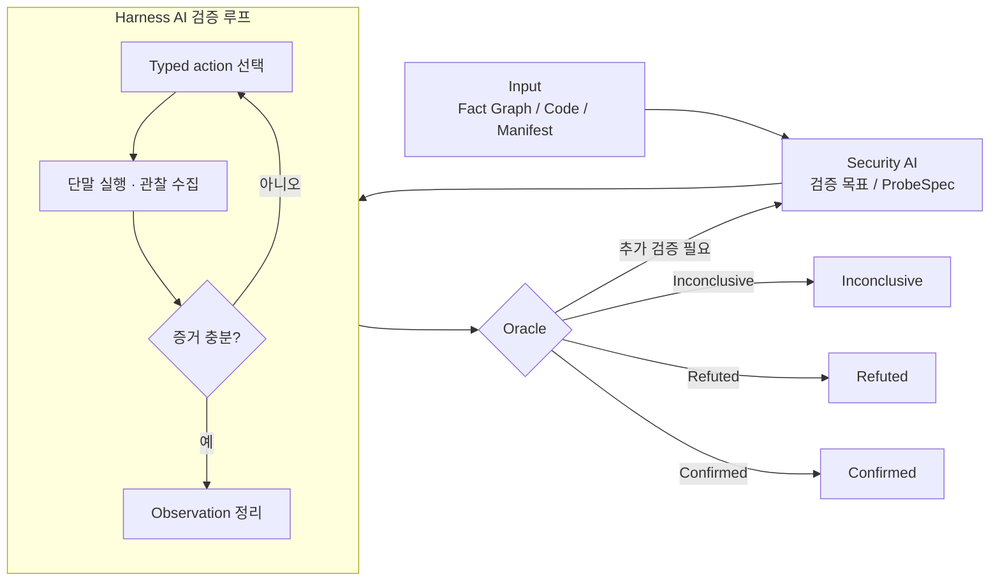

# AI 기반 Android 보안 분석 및 검증 Harness

AI 후보 분석과 단말 기반 검증 루프를 결합한 Android 보안 점검 체계

## Slide 01. 제목

# AI 기반 Android 보안 분석 및 검증 Harness

AI 후보 분석과 단말 기반 검증 루프를 결합한 Android 보안 점검 체계

## Slide 02. 추진 배경

핵심 메시지: Android 보안 점검의 범위 확대와 AI 후보 분석의 변동성을 통제할 검증 체계 필요

| 구분 | 주요 이슈 | 개선 필요성 |
| --- | --- | --- |
| 점검 범위 | Manifest, decompiled code, runtime behavior, device state 동시 확인 필요 | 분석 입력 정규화 필요 |
| AI 후보 | 동일 입력의 결과 변동, 근거 부족 추론, 사전 조건 누락 가능성 | 후보와 확정 finding 분리 필요 |
| 취약점 판단 | 실제 단말에서 재현되지 않는 후보를 그대로 채택할 위험 | 재현 증거 기반 판정 필요 |
| 운영 체계 | 분석 결과와 실행 검증 사이의 연결 기준 부족 | ProbeSpec 및 evidence 루프 필요 |

## Slide 03. 과제 목표

핵심 메시지: AI 분석, 단말 검증, evidence 판정을 하나의 표준 절차로 구성

| 단계 | 목표 | 산출물 |
| --- | --- | --- |
| AI 기반 후보 도출 | 코드, Manifest, 리포트, 실행 흐름 기반 후보 취약점 생성 | Candidate findings |
| 검증 목표 구조화 | 후보를 ProbeSpec과 필요한 evidence 조건으로 변환 | Verification Goal / ProbeSpec |
| 단말 기반 검증 | 허용된 action 안에서 재현 가능성과 관찰 결과 확인 | Observation / Artifact |
| Evidence 중심 판정 | 모델 의견이 아닌 observation과 oracle rule 기준 판정 | Confirmed / Refuted / Inconclusive |

## Slide 04. Mobile Audit Harness 구성

핵심 메시지: 도구 역할을 분리하고 Harness가 실행, 수집, 상관분석을 일관되게 관리

## Slide 05. 관련연구 및 벤치마킹 조사 - Ghera

핵심 메시지: 취약 앱 세트와 수정/benign 변형을 기준으로 재현성 검증 체계 수립

| 항목 | 내용 |
| --- | --- |
| 벤치마크 성격 | 취약 동작, 악용 앱, 수정 또는 benign 변형을 함께 둔 Android 보안 벤치마크 |
| 데모 앱 세트 고정 | 알려진 취약/수정 쌍으로 MVP 판정 안정성 확인 |
| Rule hit와 exploitability 분리 | 정적 탐지 후보와 실제 악용 조건 충족 여부를 별도 observation으로 검증 |
| 회귀 테스트 자산화 | 검증 케이스와 oracle rule을 저장하여 모델·도구 변경 시 재검증 |

Source: Ghera: A Repository of Android App Vulnerability Benchmarks

## Slide 06. 관련연구 및 벤치마킹 조사 - COVA

핵심 메시지: 정적 분석 결과를 finding이 아니라 검증 대상 가설로 취급

| 항목 | 내용 |
| --- | --- |
| 분석 관점 | source-to-sink 연결만으로 취약점을 확정하지 않는 접근 |
| 분석 결과의 가설화 | AI나 정적 분석 후보를 검증 목표와 필요한 조건 목록으로 변환 |
| 사전 조건 관찰 | 사용자 동작, 설정값, 파일/네트워크 상태를 observation에 포함 |
| Inconclusive 상태 운영 | 증거 부족 후보를 Confirmed나 Refuted로 억지 분류하지 않는 판정 체계 운영 |

Source: A Qualitative Analysis of Android Taint-Analysis Results

## Slide 07. 관련연구 및 벤치마킹 조사 - AndroidWorld

핵심 메시지: 모델 응답이 아니라 emulator 상태 변화로 작업 성공 여부 평가

| 항목 | 내용 |
| --- | --- |
| 벤치마크 성격 | 초기화, agent 실행, success checking, tear-down logic을 포함한 반복 가능한 평가 단위 |
| 검증 task lifecycle | setup, action, observe, cleanup을 하나의 ProbeSpec 실행 단위로 관리 |
| 상태 기반 oracle | UI, logcat, file, intent result 등 관찰 가능한 상태 기준 판정 |
| 실패 데이터 보존 | tear-down, retry limit, audit trail을 남겨 다음 실행에 활용 |

Source: AndroidWorld: A Dynamic Benchmarking Environment for Autonomous Agents

## Slide 08. 과제 추진 사항 - 추진 방식

핵심 메시지: 결정적 분석 틀을 먼저 고정하고 AI는 후보 생성과 검증 조정에 제한적으로 활용

AI에게 임의 탐색을 맡기기 전에 결정적 분석 틀과 구조화된 evidence를 먼저 제공

## Slide 09. 기대 효과

핵심 메시지: 분석 자동화와 단말 검증을 결합하여 finding 신뢰도와 운영 재현성 개선

| 영역 | 기대 효과 | 확인 기준 |
| --- | --- | --- |
| 자동화 | 분석 후보 생성과 반복 증거 수집을 표준 루프로 구성 | ProbeSpec 및 observation 생성 여부 |
| 재현성 | 에뮬레이터 또는 테스트 단말 상태 기준으로 결과 보존 | 실행 trace 및 artifact 보존 여부 |
| 오탐 관리 | 사전 조건 부족과 증거 부족을 finding 채택 전 분리 | Inconclusive 판정 운영 여부 |
| 확장성 | 단일 rule hit가 아닌 chain, precondition, observation 동시 판단 | 복합 시나리오 추가 가능성 |

## Slide 10. 향후 계획 - 단일 AI 구조의 한계

핵심 메시지: 분석, 실행, 판정의 책임 경계가 다르므로 역할 분리 기반 통제 필요

| 구분 | 단일 AI 흐름 | 역할 분리 흐름 |
| --- | --- | --- |
| 목표 설정 | 분석과 실행 목표가 혼재될 가능성 | Security AI가 검증 목표만 정의 |
| 실행 통제 | 위험한 단말 동작 선택 가능성 | Harness AI가 allowlisted action만 선택 |
| 증거 판단 | 증거 부족 상태에서도 결론 생성 가능성 | Oracle이 evidence 기준으로만 판정 |
| 추적성 | 실패 원인과 재현 경로 추적 어려움 | Trace, artifact, proof state 보존 |

## Slide 11. 향후 계획 - 역할 분리 기반 검증 구조

핵심 메시지: Harness AI 내부 검증 루프와 Oracle 분기를 분리해 검증 상태를 갱신

| 역할 기반 분리 이유 | 요지 |
| --- | --- |
| 책임 경계 명확화 | 목표 설정, 실행, 판정을 별도 책임으로 분리 |
| 실행 권한 통제 | Harness AI는 allowlisted action 범위에서만 실행 |
| 증거 기반 판정 | Oracle은 저장된 evidence와 rule 기준으로만 판정 |

## Slide 12. 향후 계획 - Security AI

핵심 메시지: 무엇을 검증할지 결정하고 실행 가능한 ProbeSpec으로 구조화

| 입력 | 처리 | 출력 |
| --- | --- | --- |
| Fact Graph / Decompiled Code / Manifest | 취약 체인 가설 수립 | Chain Hypothesis |
| Candidate findings | 필요 evidence 및 proof boundary 정의 | Verification Goal / Evidence Requirement |
| 분석 산출물 | 검증 대상과 제외 범위 분리 | ProbeSpec |

검증 패턴: External actor -> Mutable Artifact -> Privileged Consumer -> Sensitive Sink

## Slide 13. 향후 계획 - Harness AI

핵심 메시지: 허용된 action 안에서 단말 실행과 observation 수집을 조정

| 단계 | 내용 |
| --- | --- |
| ProbeSpec 수신 | 검증 목표와 현재 Proof State 확인 |
| Typed Action 선택 | write_artifact, collect_logcat, check_ui_state 등 허용 action 선택 |
| 실행 및 수집 | ADB, Tool, 단말 결과 수집 |
| 정리 및 보고 | Observation Summary와 cleanup 결과 기록 |

| 통제 항목 | 내용 |
| --- | --- |
| Action 제한 | raw adb/shell 직접 노출 차단 및 allowlist 기반 실행 |
| 반복 한계 | Bounded retry와 실패 trace 보존 |
| 감사 추적 | 실행 명령, raw signal, artifact를 evidence bundle로 관리 |

## Slide 14. 향후 계획 - Verifier / Oracle

핵심 메시지: 저장된 evidence와 oracle rule 기준으로 최종 상태를 판정

| 상태 | 판정 의미 | 처리 방향 |
| --- | --- | --- |
| Confirmed | 요구한 evidence와 oracle 조건 충족 | finding 후보로 채택 가능 |
| Refuted | 관찰 결과가 가설 또는 oracle 조건과 불일치 | 후보 제외 또는 가설 수정 |
| Inconclusive | 증거 부족 또는 사전 조건 미충족 | 추가 검증 목표로 회수 |

판정 원칙: 최종 판단은 모델 설명이 아니라 저장된 observation, trace, artifact, oracle rule에 근거

## Slide 15. 피드백 확인 포인트

핵심 메시지: MVP 범위, 검증 환경, finding 채택 기준, 다음 단계 산출물 확정 필요

| 확인 항목 | 논의 내용 | 결정 필요 사항 |
| --- | --- | --- |
| 우선 취약점 유형 | exported component, WebView bridge, deeplink, storage, network | MVP 검증 범위 |
| 검증 환경 | emulator, real device, OS version, 테스트 계정, 데이터 초기화 | 운영 기준 |
| Finding 채택 기준 | Confirmed / Refuted / Inconclusive 판정과 보고서 반영 | 보고 기준 |
| 다음 단계 산출물 | ProbeSpec schema, evidence bundle, oracle rule, 데모 앱 세트 | 착수 항목 |
