# Codex와 Android Deeplink Audit 사용자 가이드

CLI 설치, 저장소 초기화, Codex 연동 흐름을 사용자 가이드 형식으로 정리한 발표 자료입니다.

## Slide 01

# Codex와 Android Deeplink Audit 사용자 가이드

## 설치부터 활용까지 한 번에 보기

<div class="mt-8 text-lg opacity-80">
CLI 설치, init 셋업, Codex 활용 흐름, 산출물 확인 방법
</div>

## Slide 02

# 목표

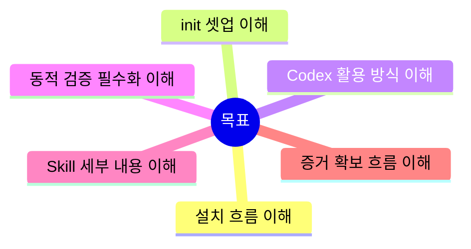

## Slide 03

# 전체 구조 한눈에 보기

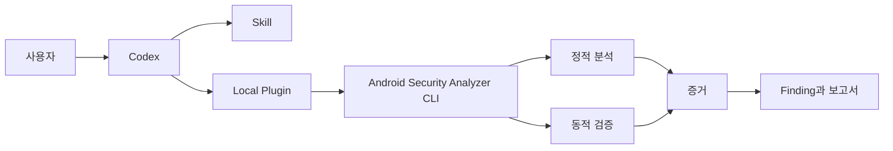

- 핵심은 Codex가 직접 분석 엔진이 아니라, 설치된 Skill과 CLI를 조율한다는 점이다.
- 정적 분석만으로 끝내지 않고 동적 검증까지 수행해 증거를 확보한다.

## Slide 04

# 설치 단계

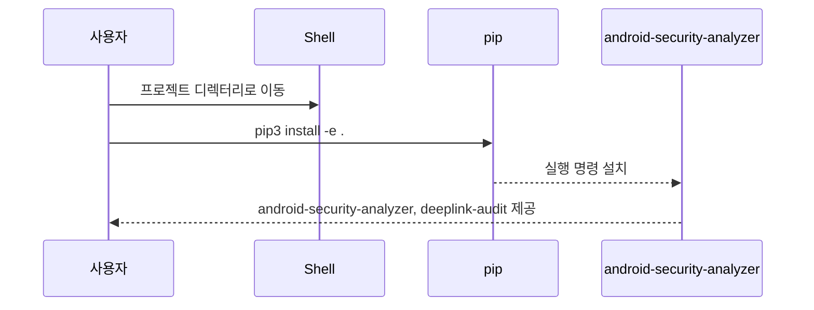

```bash
pip3 install -e .
```

설치 후 사용할 수 있는 명령
- `android-security-analyzer`
- `deeplink-audit`

## Slide 05

# 엔트리포인트 구조

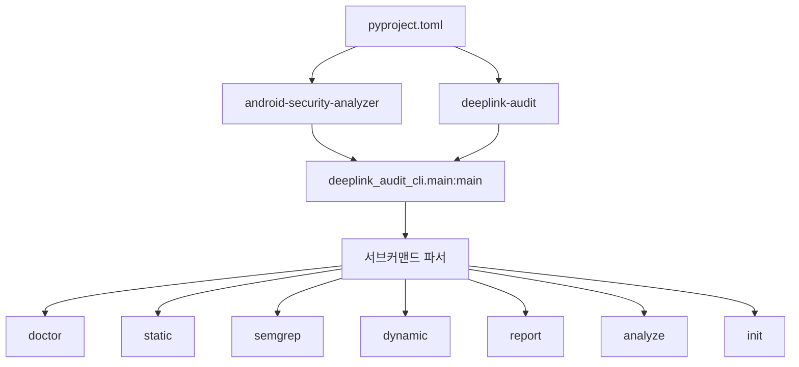

- 이름은 두 개지만 내부 진입점은 하나다.
- 그래서 명령 별칭이 달라도 동일한 실행 흐름을 탄다.

## Slide 06

# init 명령의 역할

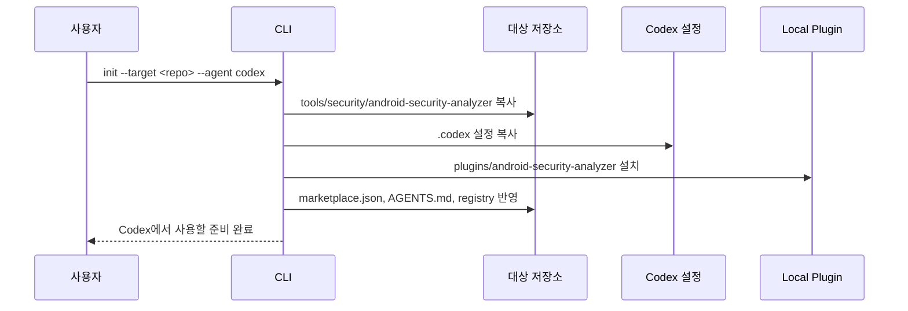

- `init`은 분석을 수행하는 명령이 아니라, 분석을 위한 실행 환경을 대상 저장소에 심는 단계다.

## Slide 07

# 대상 저장소에 생기는 구조

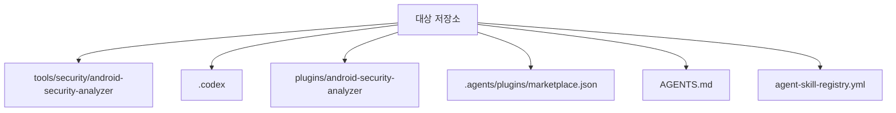

```text
tools/security/android-security-analyzer/
.codex/
plugins/android-security-analyzer/
.agents/plugins/marketplace.json
AGENTS.md
agent-skill-registry.yml
```

## Slide 08

# tools 폴더의 실제 역할

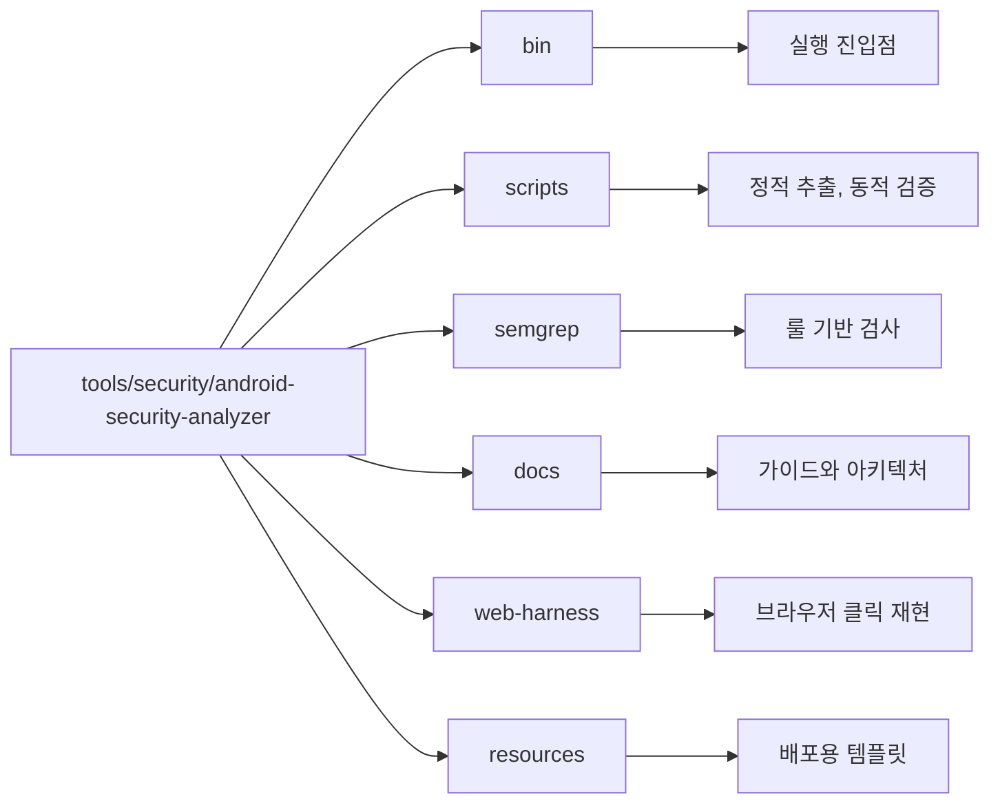

- 이 폴더는 Codex가 간접적으로 쓰는 실제 분석 자산 모음이다.

## Slide 09

# Codex 설정은 왜 필요한가

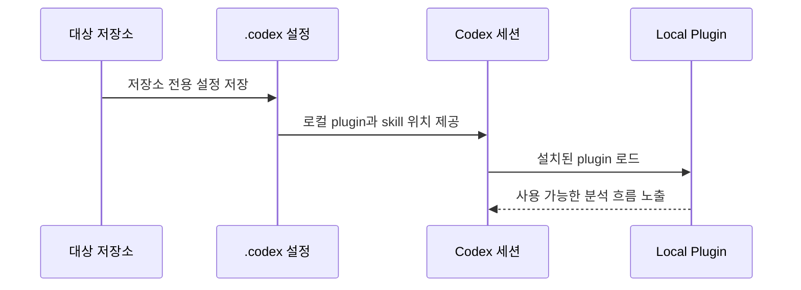

- Codex는 이 설정을 보고 저장소별 도구를 인식한다.
- 이 단계가 없으면 일반 파일 편집 세션으로만 동작한다.

## Slide 10

# 로컬 plugin 등록 방식

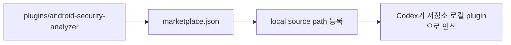

- plugin은 “분석 기능이 여기 있다”는 연결점이다.
- 실제 실행 엔진은 여전히 CLI 쪽에 있다.

## Slide 11

# Skill이 하는 일

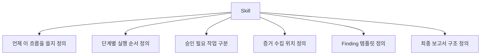

구체적으로 Skill에 들어가야 할 내용
- 대상 입력값 형식
- 정적 분석에서 확인할 항목
- 동적 검증에서 반드시 확인할 항목
- 증거 저장 규칙
- finding 제목과 severity 형식
- MASVS나 내부 기준 매핑 방식

핵심 메시지
- Skill은 단순 설명문이 아니라, Codex가 따라야 할 감사 절차서다.

## Slide 12

# plugin이 하는 일

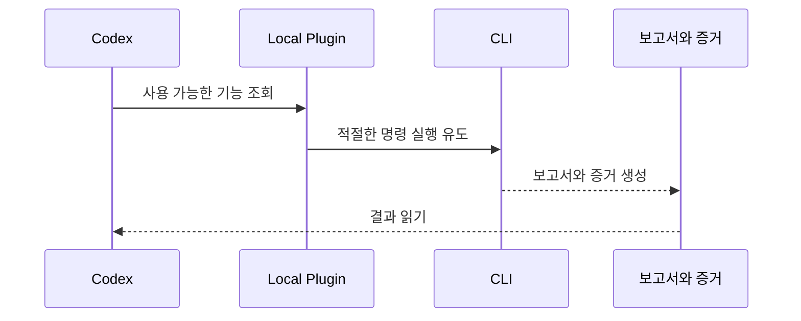

- plugin은 Codex와 CLI 사이의 연결점이다.
- plugin이 분석 로직을 대신 구현하는 것은 아니다.

## Slide 13

# 실제 분석 엔진은 CLI다

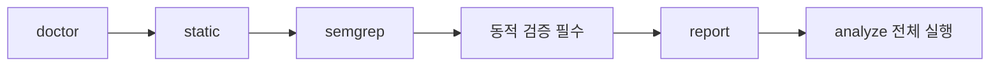

각 단계 설명
- `doctor`: 도구와 환경 준비 상태 확인
- `static`: manifest와 소스에서 딥링크 엔트리 추출
- `semgrep`: validation, sink, 위험 패턴 탐지
- `dynamic`: 실제 호출로 증거 확보, 결과 검증
- `report`: 증거를 묶어 finding과 보고서 생성

중요
- 여기서는 동적 검증을 선택 기능이 아니라 필수 증거 확보 단계로 본다.

## Slide 14

# Codex가 실제로 활용하는 흐름

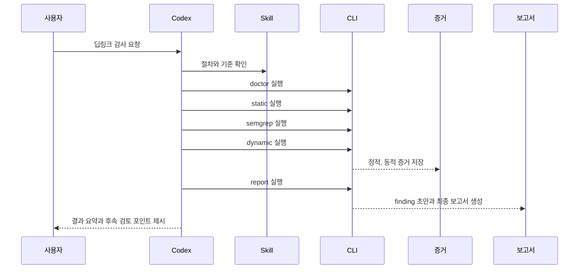

## Slide 15

# 사용자는 어떻게 요청하면 좋은가

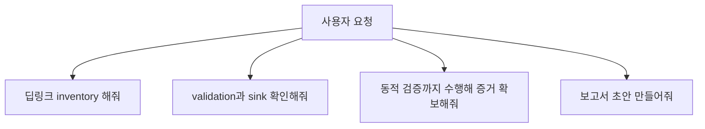

권장 요청 방식
- 대상 앱과 범위를 먼저 명시
- 동적 검증까지 포함한다고 분명히 말하기
- 최종 산출물 형식도 같이 지정하기

## Slide 16

# 권장 실행 흐름

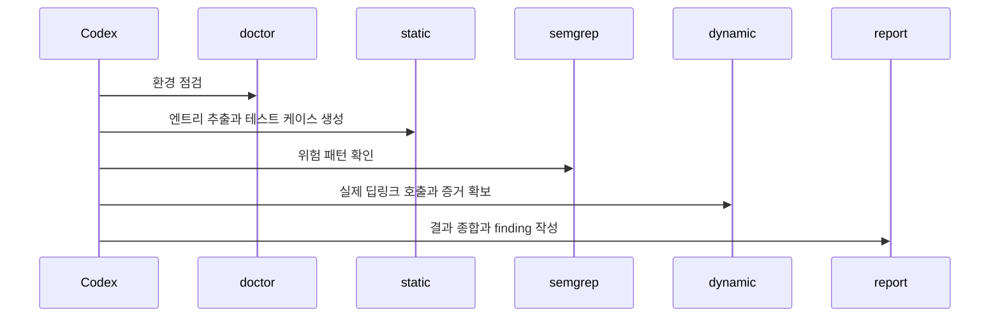

이 흐름을 권장하는 이유
- 정적 분석만으로는 실제 재현 가능성을 확정하기 어렵다.
- 동적 검증까지 해야 증거가 살아난다.

## Slide 17

# 주요 산출물과 확인 포인트

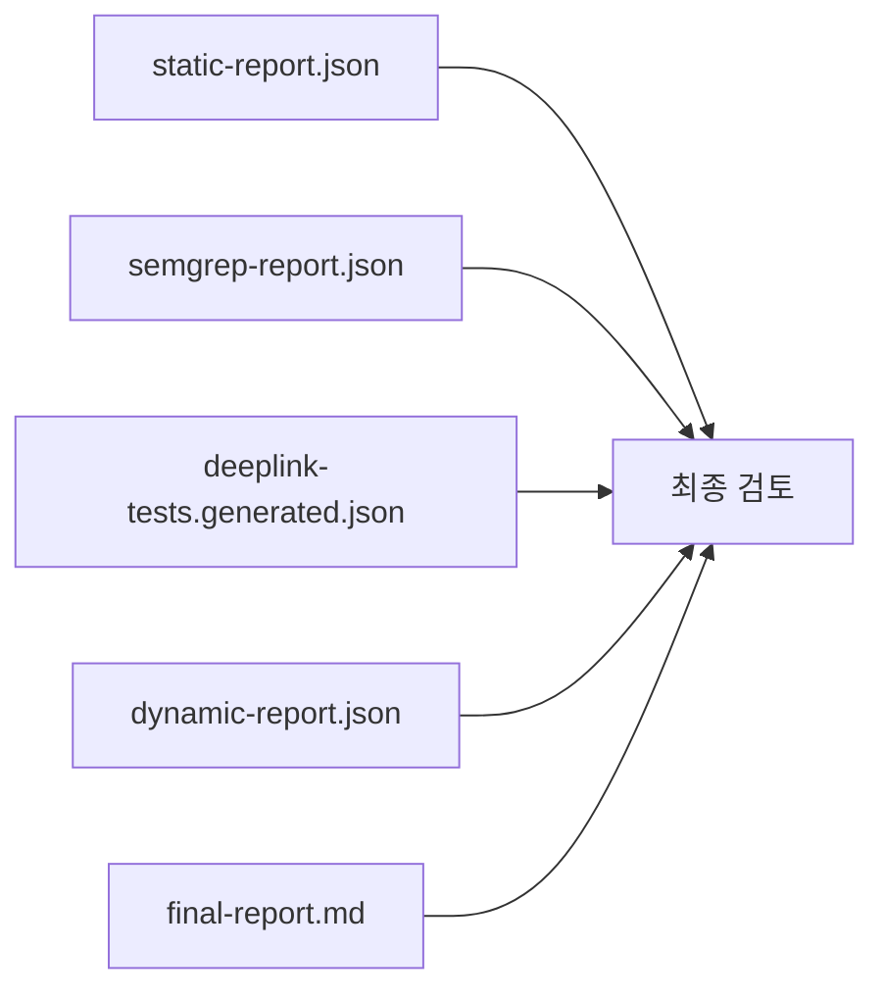

각 파일의 의미
- `static-report.json`: 엔트리포인트와 manifest 중심 정적 결과
- `semgrep-report.json`: 코드 패턴과 위험 후보
- `deeplink-tests.generated.json`: 동적 검증에서 재사용할 테스트 입력
- `dynamic-report.json`: 실제 실행 기반 증거
- `final-report.md`: 보고서 초안

## Slide 18

# 사용자가 얻는 실제 가치

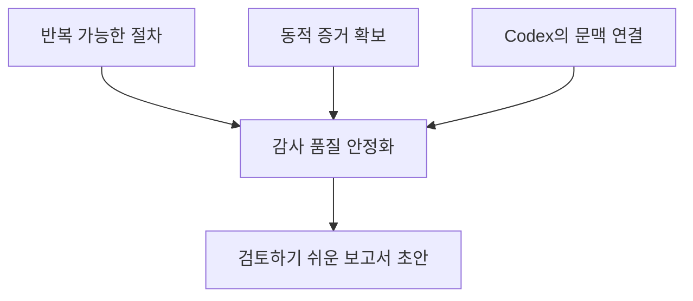

- 단순 자동화가 아니라, 증거 기반 감사 흐름을 반복 가능하게 만든다.

## Slide 19

# CLI 단독 사용과 Codex 연동의 차이

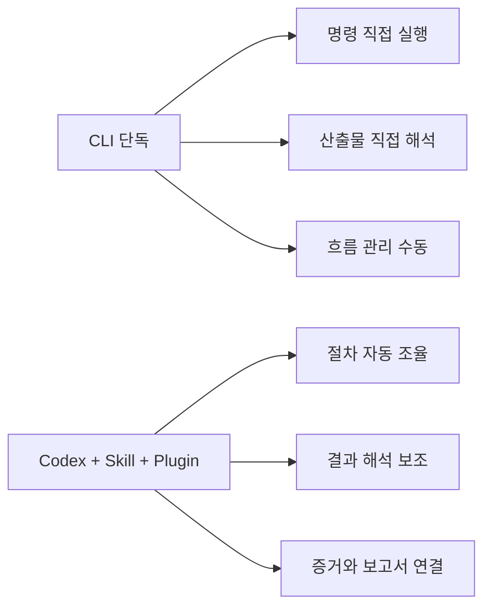

- CLI만으로도 실행할 수 있지만, Codex를 연동하면 절차 관리와 결과 해석 부담이 줄어든다.

## Slide 20

# 결론

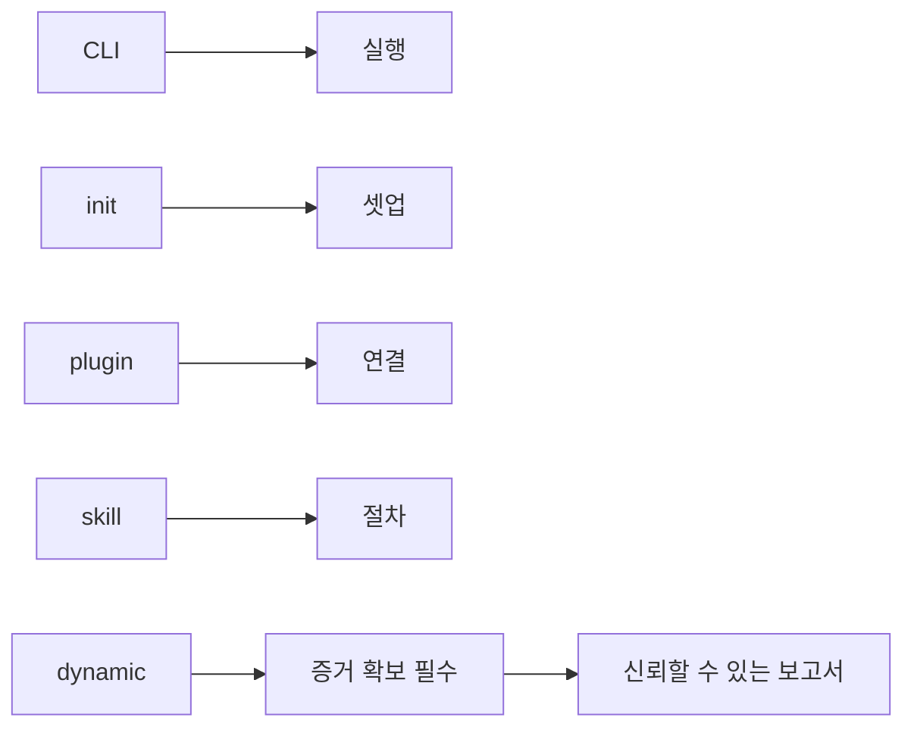

정리
- CLI는 분석 엔진이다.
- init은 Codex가 그 엔진을 쓰게 만드는 셋업 단계다.
- plugin은 연결점이고, skill은 절차다.
- 정적 분석만으로 끝내지 않고 동적 검증까지 수행해야 증거를 확보할 수 있다.
