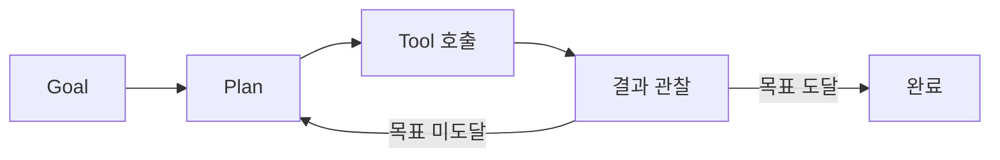
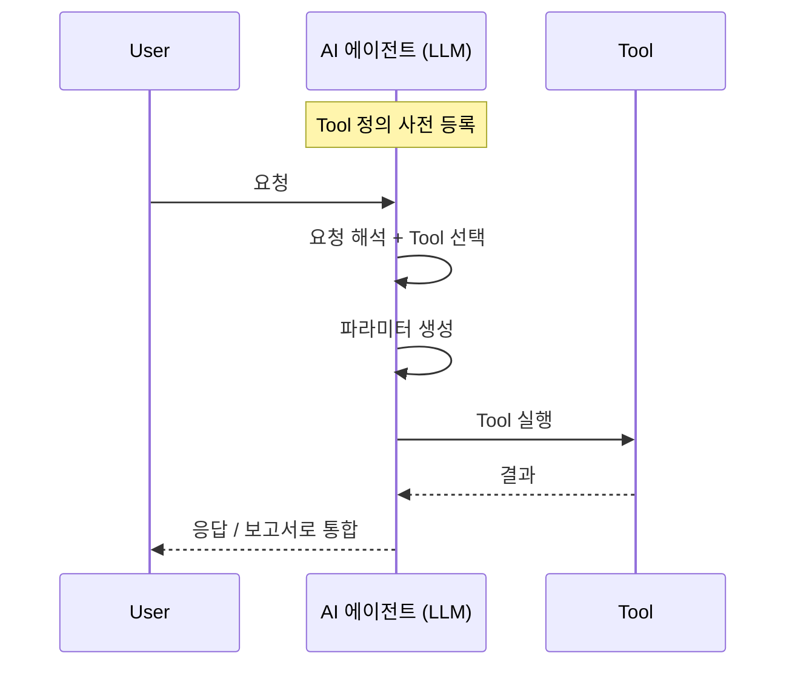
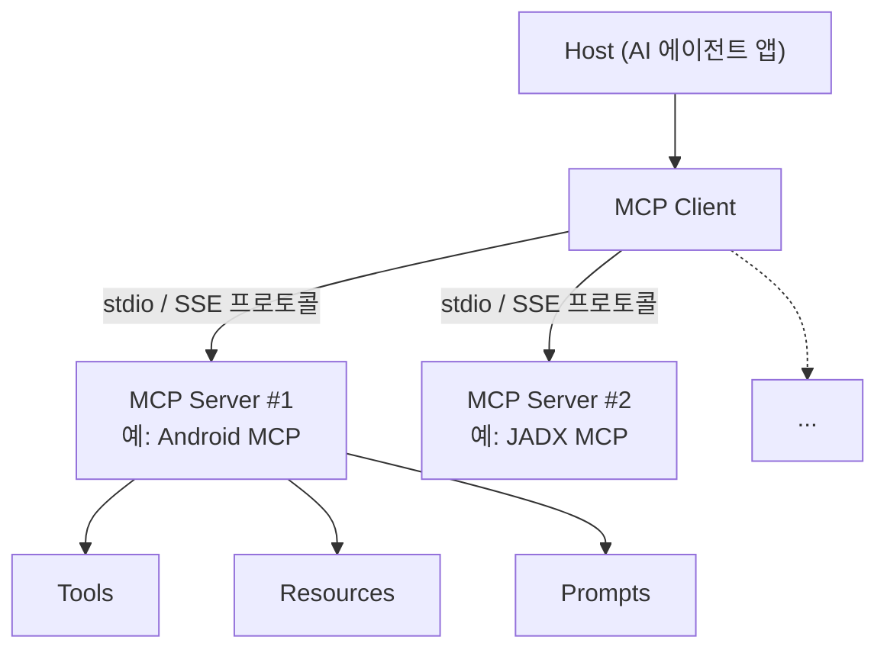
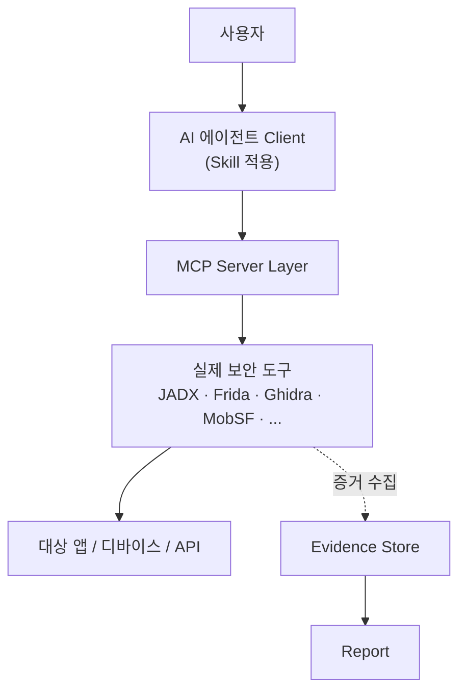
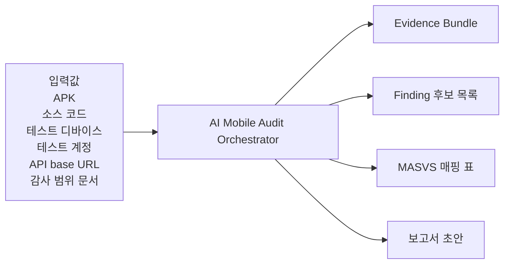
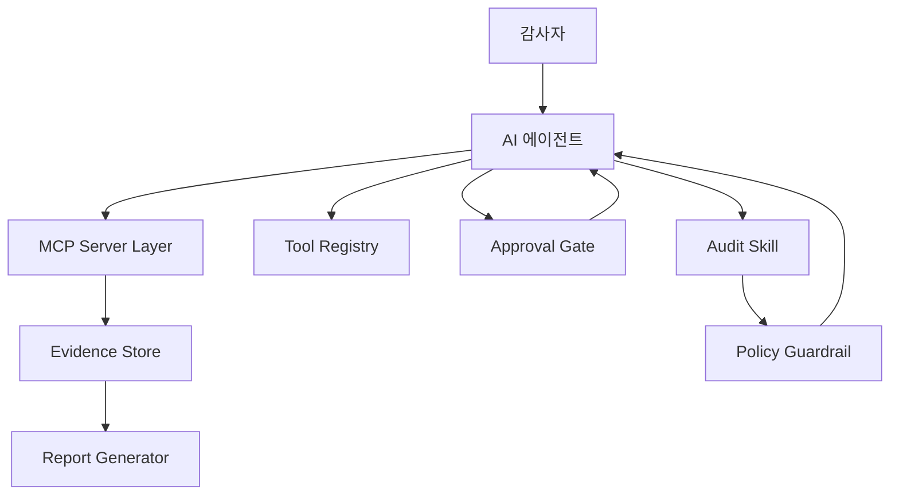
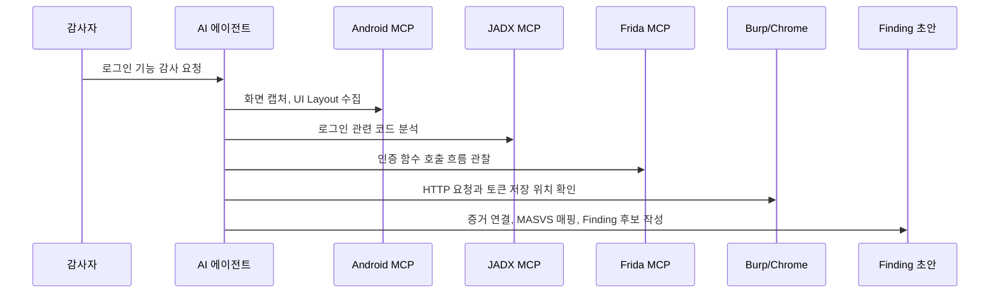
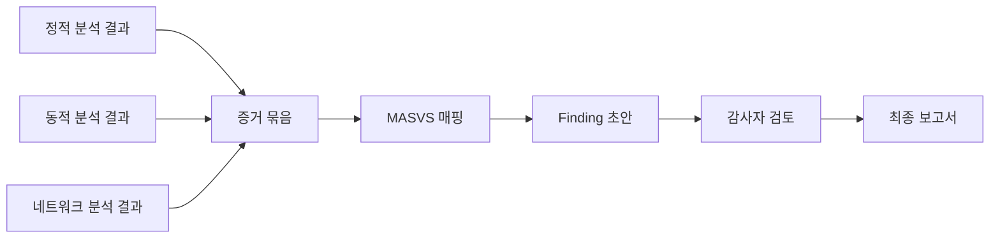

# MCP로 구성하는 AI 기반 모바일 앱 보안 감사

MCP, Tool, Skill, 감사 시스템, 운영 통제를 중심으로 모바일 앱 보안 감사를 운영하는 방법을 설명하는 발표 자료입니다.

## Slide 01

# MCP로 구성하는 AI 기반 모바일 앱 보안 감사

## 개념 정리, 도구 적용, 감사 시스템, Skill, 운영 통제

<div class="mt-8 text-lg opacity-80">
모바일 앱 보안 감사를 MCP와 Skill 중심으로 어떻게 운영할지 설명하는 발표 자료
</div>

<div class="mt-16 text-sm opacity-60">
작성일: 2026-04-24 · 범위: Android 앱 감사, MCP Server, Skill 설계, 보안 통제
</div>

## Slide 02

# 발표 목표와 범위

- MCP, Tool, Skill의 차이를 명확히 이해
- 모바일 앱 감사용 MCP 도구체인 구성
- 각 도구를 어디에 쓰는지와 사용 예시 파악
- AI 기반 감사 시스템 구조 설계
- 보안 통제와 사람 승인 절차 운영 원칙 정리


# 제외 범위

- 무단 대상 공격 자동화
- 무승인 능동 스캔
- 우회 기법의 무분별한 자동 실행

## Slide 03

# 모바일 감사: 일반적인 작업 구조

1. 감사 범위 확인
2. APK, IPA, 소스 코드 확보
3. Manifest, 권한, 컴포넌트 분석
4. 취약 패턴과 민감정보 분석
5. 디바이스 실행 후 로그와 화면 수집
6. 런타임 값과 함수 호출 관찰
7. 네이티브 라이브러리 분석
8. WebView와 API 트래픽 분석
9. 증거 정리와 보고서 작성

## Slide 04

# 감사 기준: MASVS / MASTG로 정렬

- Finding을 MASVS 항목에 매핑
- 테스트 절차를 MASTG 기반으로 구성
- 도구별 결과를 통제 항목별 증거로 정리

```text
Tool Result -> Evidence -> MASVS Mapping -> Finding
```

## Slide 05

# AI 에이전트: 일반 LLM과의 차이

| 구분 | 특징 |
|---|---|
| 일반 LLM | 생성과 요약에 강하지만 도구 실행은 못함 |
| AI 에이전트 | 목표 분해, 도구 선택, 결과 해석, 다음 행동 결정 |



핵심: LLM에 *도구 호출 + 루프* 가 결합된 구조

- 명령어 변환기
- 분석 보조자
- 증거 관리자
- 보고서 작성자

## Slide 06

# Tool Calling: 모델이 도구를 호출하는 방식



1. Tool 정의 등록
2. 사용자 요청 해석
3. 실행할 Tool 선택
4. 파라미터 생성
5. Tool 실행
6. 결과 수신
7. 보고서나 요약으로 통합

```json
{
  "tool": "get_device_info",
  "arguments": {"device_id": "R5CR123ABC4"}
}
```

## Slide 07

# MCP: Host / Client / Server 3층 구조



- **Host**: AI 에이전트를 실행하는 앱 (Claude Code, Codex 등)
- **MCP Client**: Host 안에서 서버와 표준 프로토콜로 통신
- **MCP Server**: 도구 묶음을 노출 — Tools / Resources / Prompts
- Client 하나에 여러 Server 연결 가능

MCP는 AI 애플리케이션과 외부 도구를 연결하는 표준 프로토콜이다.

## Slide 08

# MCP와 Tool: 같은 단어 같지만 다른 층위

| 구분 | 의미 |
|---|---|
| MCP | 연결 방식 |
| MCP Server | 도구 묶음 |
| Tool | 실행 단위 |
| Skill | 절차와 템플릿 |

- 부정확: MCP로 스크린샷을 찍는다
- 정확: Android MCP Server의 스크린샷 Tool을 호출한다

## Slide 09

# Skill: 절차와 판단 기준의 표준화

- 반복 감사 절차 표준화
- 도구 호출 순서 정의
- 판단 기준 제공
- 보고서 템플릿 제공
- 산출물 저장 규칙 정의

```text
mobile-app-security-audit/
  SKILL.md
  references/
  templates/
  scripts/
```

## Slide 10

# 테스트 랩 구성

- Python 3.10+
- Node.js LTS
- Git
- Android SDK Platform-Tools
- JDK
- Android 디바이스 또는 에뮬레이터
- MCP 지원 Client
- JADX, Frida, Ghidra, Chrome, Burp, MobSF, Semgrep, CodeQL

## Slide 11

# MCP Client 설정 구조

```json
{
  "mcpServers": {
    "android": {
      "command": "uv",
      "args": ["--directory", "<tool-root>", "run", "server.py"]
    }
  }
}
```

- 서버별 로그와 버전 기록
- 위험 도구 자동 승인 금지

## Slide 12

# 전체 감사 아키텍처



- 사용자는 에이전트에게 감사 요청
- Skill이 절차를 표준화, MCP Server Layer가 도구를 노출
- 도구는 실제 대상에 작동, 결과를 Evidence Store로 모음
- 보고서가 최종 산출물

## Slide 13

# HITL: 사람 승인 지점

승인 필요 작업
- 앱 설치와 삭제
- 파일 pull, push
- Frida 스크립트 주입
- 능동 스캔
- 이슈와 PR 생성

자동 실행 가능한 작업
- 정보 조회
- 화면 캡처
- 로그 필터링
- 보고서 초안 생성

## Slide 14

# 감사 시스템 전체 흐름



입력값
- APK
- 소스 코드 저장소
- 테스트 디바이스
- 테스트 계정
- API base URL
- 감사 범위 문서

출력값
- Evidence Bundle
- Finding 후보 목록
- MASVS 매핑 표
- 보고서 초안

## Slide 15

# 감사 시스템 컴포넌트



- AI 에이전트
- Audit Skill
- Tool Registry
- Approval Gate
- MCP Server Layer
- Evidence Store
- Report Generator
- Policy Guardrail

## Slide 16

# 단계별 실행 흐름


1. 대상 등록
2. 기본 정보 수집
3. 정적 분석
4. 런타임 분석
5. 네이티브 분석
6. 웹/API 분석
7. 보고서화

원칙: 먼저 자동 수집, 이후 사람이 검토

## Slide 17

# Android MCP: 디바이스 제어와 증거 수집

- 디바이스 정보 확인
- 앱 설치, 실행 상태 확인
- 스크린샷 수집
- UI Layout XML 수집
- Logcat 수집
- 패키지 정보와 권한 확인

## Slide 18

# Android MCP: 설치와 실행

```bash
adb devices
adb shell getprop ro.product.model
adb shell pm list packages
```

- ADB 연결 안정화
- 대상 디바이스 지정
- MCP Client 설정

## Slide 19

# Android MCP: 실전 예시

- 현재 앱 화면 캡처
- UI Layout 분석
- 입력 필드와 버튼 정리
- Login 버튼 좌표 계산
- 이후 인증 관련 logcat 수집

## Slide 20

# JADX MCP: 정적 분석

- 디컴파일 코드 분석
- Manifest 분석
- 권한과 컴포넌트 확인
- Exported Component 탐지
- Secret, API Key, Token 탐지
- 저장소, 인증, 네트워크 코드 위치 식별

## Slide 21

# JADX MCP: 설치와 실행

- JADX 설치
- MCP 플러그인 설치
- APK 로드
- MCP 서버 실행
- Client에 서버 등록
- 현재 클래스와 Manifest 조회

## Slide 22

# JADX MCP: 실전 예시

- MainActivity 요약
- 하드코딩 API Key, Token, Password 확인
- 관련 코드 라인 정리
- WebView 사용 클래스 검색
- addJavascriptInterface와 setJavaScriptEnabled 확인

## Slide 23

# Frida MCP: 런타임 분석

- 복호화되는 값 확인
- 함수 호출 인자와 반환값 로깅
- 인증, 암호화, 네트워크 흐름 추적
- 동적 클래스 로딩 탐지
- 네이티브 함수 호출 관찰

## Slide 24

# Frida MCP: 설치와 실행

```bash
pip install frida-tools
frida-ps -U
```

- frida-server 준비
- 버전 일치 확인
- spawn 또는 attach 선택
- 테스트 계정 사용

## Slide 25

# Frida MCP: 실전 예시

- validateUser 메서드 호출 추적
- 인자와 반환값 로그
- 실패와 성공 조건 요약
- Cipher.init 호출에서 알고리즘과 모드만 요약

## Slide 26

# Ghidra MCP: 네이티브 분석

- JNI 함수 분석
- 네이티브 코드 디컴파일
- 암호화, 복호화 루틴 식별
- 문자열 복호화 추적
- 안티디버깅, 안티탬퍼링 탐지

## Slide 27

# Ghidra MCP: 설치와 실행

- Ghidra 설치
- JDK 설치
- `.so` 추출 후 로드
- Auto Analysis 실행
- MCP 플러그인과 Bridge 연결
- Client에 ghidra 서버 등록

## Slide 28

# Ghidra MCP: 실전 예시

- JNI 함수 검색
- 디컴파일 코드 조회
- 호출 함수와 참조 데이터 추적
- 반환값 생성 방식 설명
- 안티디버깅 문자열 후보 탐색

## Slide 29

# 단독 도구에서 묶음 도구로

## 한 도구씩 보는 단계에서 여러 도구를 조합하는 단계로

- 단독 도구: Android · JADX · Frida · Ghidra
- 묶음 도구: WebView·웹 · 정적 스캐너 · 네트워크·워크플로우
- 묶음 도구는 한 영역을 여러 도구로 함께 다룹니다

## Slide 30

# WebView·웹 MCP: Chrome DevTools / Playwright

- DOM 구조 분석
- 로그인과 회원가입 플로우 자동화
- 네트워크 요청과 응답 분석
- LocalStorage, SessionStorage, Cookie 확인
- XSS와 CSP 후보 탐지

## Slide 31

# WebView·웹 MCP: 설치와 실행

```json
{
  "mcpServers": {
    "chrome-devtools": {"command": "npx", "args": ["-y", "chrome-devtools-mcp@latest"]},
    "playwright": {"command": "npx", "args": ["-y", "@playwright/mcp@latest"]}
  }
}
```

- WebView 디버깅 활성화 확인
- 페이지 콘텐츠를 에이전트 지시문으로 신뢰하지 않기

## Slide 32

# WebView·웹 MCP: 실전 예시

- 테스트 로그인 페이지 이동
- 테스트 계정 입력과 로그인 실행
- Network 요청 목록 조회
- Storage와 Cookie 확인
- CSP, Console Error, Mixed Content 점검

## Slide 33

# 정적 스캐너 MCP: MobSF / Semgrep / CodeQL

- MobSF: 모바일 앱 1차 정적 분석
- Semgrep: 룰 기반 SAST
- CodeQL: 데이터플로우 기반 정적 분석

자동 스캐닝은 finding을 확정하는 도구가 아니라 후보를 모으는 도구입니다.

## Slide 34

# 정적 스캐너 MCP: 설치와 실행

- MCP Server 직접 연결
- CLI Tool 래핑
- Skill 안의 스크립트화

```text
scripts/
  run-mobsf-static-scan.ps1
  run-semgrep-mobile-rules.ps1
  normalize-codeql-results.py
```

## Slide 35

# 정적 스캐너 MCP: 실전 예시

- APK에 대해 MobSF 정적 분석 실행
- High, Medium 이슈 필터링
- MASVS 기준 분류
- JADX로 추가 확인할 코드 위치 제안

## Slide 36

# 네트워크·워크플로우 MCP: Burp / ZAP / GitHub

- Burp와 ZAP으로 HTTP, API 보안 분석 연결
- GitHub MCP로 이슈와 PR 흐름 연결
- 트래픽 증거와 코드 증거를 같은 보고서에 묶기

## Slide 37

# 네트워크·워크플로우 MCP: 설치와 실행

- 프록시 구성
- 대상 범위 제한
- 자동 승인 정책 신중 설정
- 최소 권한 토큰 사용
- 능동 스캔은 승인 후 수행

## Slide 38

# 네트워크·워크플로우 MCP: 실전 예시

- `/api/login` 이후 요청 분석
- Authorization 헤더 방식 확인
- 토큰 저장 위치 확인
- 민감정보 평문 전송 여부 확인
- 확정 Finding을 GitHub Issue 초안으로 변환

## Slide 39

# 시나리오: 로그인 기능 감사



- 화면 캡처와 UI Layout 수집
- 로그인 관련 코드 분석
- 인증 함수 호출 흐름 관찰
- HTTP 요청 확인
- 토큰 저장 위치 확인
- MASVS 기준으로 매핑

## Slide 40

# Finding 작성 흐름



```markdown
# Finding: 제목
## 요약
## 영향도
## 영향 범위
## 재현 절차
## 증거
## 기준 매핑
## 권고 조치
## 검증 방법
```

## Slide 41

# Skill 설계: 감사 Skill의 구성

- 절차 표준화
- MASVS 기준 매핑
- Finding 품질 균일화
- 증거 누락 방지
- 반복 감사 시간 단축

## Slide 42

# Skill 설계: 단계별 Tool 매핑

| 단계 | Android | JADX | Frida | Ghidra | WebView·웹 | 정적 스캐너 | 네트워크·워크플로우 | Skill |
|---|:---:|:---:|:---:|:---:|:---:|:---:|:---:|:---:|
| 대상 식별 | ● | | | | | | | |
| Manifest 분석 | | ● | | | | ● | | |
| Secret 탐지 | | ● | | | | ● | | |
| 인증 분석 | | ● | ● | | | | ● | |
| 네트워크 분석 | | | | | ● | | ● | |
| 네이티브 분석 | | | ● | ● | | | | |
| 보고서화 | | | | | | | | ● |

- 단독 도구 4개 + 묶음 도구 3개 + Skill 보고서 = 8개 영역
- 각 단계는 1–3개 도구가 협력
- 정적 스캐너 = MobSF / Semgrep / CodeQL
- 네트워크·워크플로우 = Burp / ZAP / GitHub

## Slide 43

# Skill 설계: 프롬프트 템플릿

- 대상 등록 프롬프트
- 정적 분석 프롬프트
- 동적 분석 프롬프트
- 보고서화 프롬프트

프롬프트는 짧고 명확하게, 판단 기준은 reference 파일로 분리한다.

## Slide 44

# Skill 설계: 증거 묶음 표준

```text
evidence/{app_name}/{date}/
  00_scope/
  01_device/
  02_static/
  03_dynamic/
  04_native/
  05_network/
  06_findings/
```

- 증거 경로
- 테스트 일시
- 도구 버전
- 도구 호출 요약
- 민감정보 마스킹 여부

## Slide 45

# 운영 통제: MCP 도구의 리스크

- 과도한 Tool 권한
- 셸 명령 오남용
- 민감정보 유입
- 프롬프트 인젝션
- 검증되지 않은 MCP Server
- 자동 승인으로 인한 예기치 않은 실행
- 범위 초과 스캔

## Slide 46

# 운영 통제: 안전한 운영 체크리스트

사전
- 승인된 범위 문서 확보
- 테스트 계정 준비
- MCP Server 출처와 버전 확인
- 위험 도구 자동 승인 비활성화

실행 중
- 능동 스캔 전 승인 확인
- 대상 함수와 경로 확인
- 민감정보 포함 여부 점검

사후
- 증거 무결성 확인
- Finding 후보와 확정 Finding 분리
- 재검증 절차 포함

## Slide 47

# 결론: MCP는 연결, Tool은 실행, Skill은 절차

- MCP는 도구를 연결하는 프로토콜
- Tool은 실제 실행 단위
- Skill은 절차와 판단 기준
- 에이전트는 절차와 도구 호출을 조율하는 역할
- 최종 판단과 책임은 감사자에게 남습니다

## Slide 48

# Q&A

## Slide 49

# 참고 자료

- MCP Specification
- Claude Code Tools, MCP, Skills
- OpenAI Codex MCP, Config
- OWASP MASVS, MASTG
- Android MCP, JADX MCP, Frida MCP, GhidraMCP
- Chrome DevTools MCP, Playwright MCP
- Semgrep MCP, CodeQL Development MCP Server
- MobSF
- GitHub MCP Server
