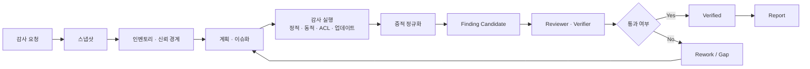
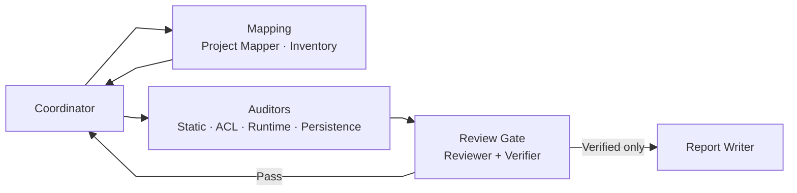
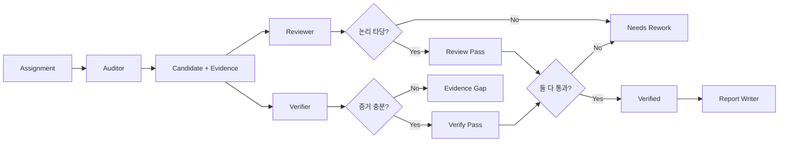
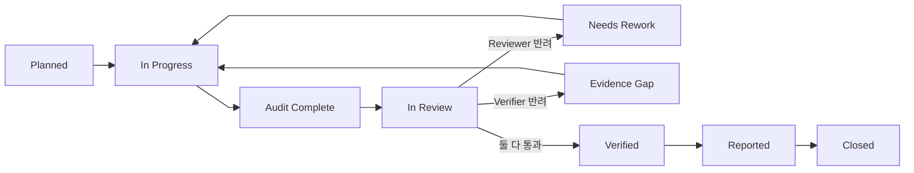
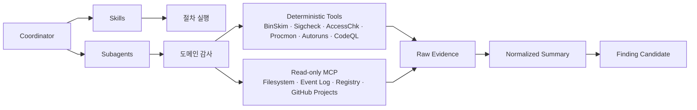
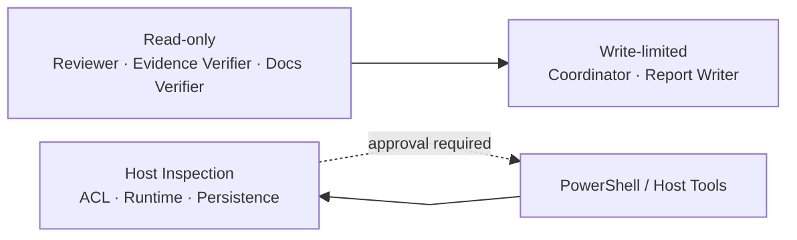
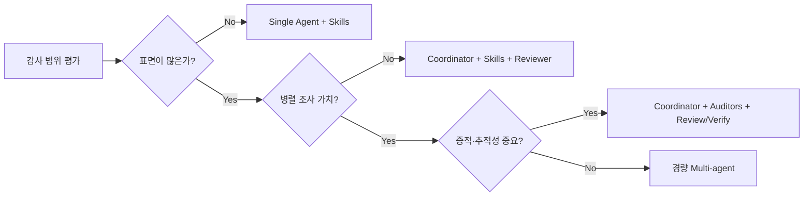

# LLM 기반 Windows 애플리케이션 보안 감사 운영 구조

Windows 애플리케이션 보안 감사를 LLM, skills, subagents, MCP,

## Slide 01

# LLM 기반 Windows 애플리케이션 보안 감사 운영 구조

## 체크리스트 · 작업 보고 · Subagent 검증 게이트 설계

<div class="mt-8 text-lg opacity-80">
Windows 앱 보안 감사를 장기 작업·증적 중심 워크플로로 운영하기 위한 Slidev 자료
</div>

<div class="mt-16 text-sm opacity-60">
작성일: 2026-04-24 · 범위: Windows 앱 보안 감사, LLM 에이전트 운영, MCP 보안 통제
</div>

## Slide 02

# 1. 문제 정의

## Slide 03

# Windows 앱 보안 감사의 난점

- 감사 대상이 넓고 복잡함
  - EXE / DLL / MSI / MSIX
  - 서비스, scheduled task, COM, shell extension
  - installer / updater / helper process
- 증적이 여러 위치에 흩어져 있음
  - 파일, 레지스트리, 이벤트 로그, 프로세스 트레이스
- LLM 단독 판단은 재현성과 감사 추적성이 약함
- 체크리스트만으로는 실제 실행 상태를 따라가기 어려움

::right::

# 운영 목표

- 프로젝트 현황을 먼저 파악
- 체크리스트를 자산별 작업으로 분해
- Auditor가 증적 기반으로 후보 finding 생성
- Reviewer와 Verifier가 독립적으로 검증
- Coordinator가 검증을 통과한 결과만 채택
- 최종 보고서에는 Verified finding만 반영

## Slide 04

# 핵심 설계 질문

<div class="text-xl mt-8">
LLM을 활용하면서도 보안 감사의 <b>재현성, 추적성, 증거성, 권한 통제</b>를 어떻게 유지할 것인가?
</div>

<div class="mt-10 grid grid-cols-2 gap-6">
<div>

## 피해야 할 구조

- 단일 LLM이 모든 판단을 수행
- raw evidence 없이 결론을 도출
- 체크리스트와 실행 상태를 혼합
- MCP에 과도한 실행 권한을 부여
- Reviewer 없이 finding을 확정

</div>
<div>

## 지향할 구조

- 짧은 지침 + 분리된 문서
- skill 기반 반복 절차
- 좁은 subagent 역할
- deterministic tool이 1차 증거를 생산
- Reviewer / Verifier 게이트

</div>
</div>

## Slide 05

# 2. 핵심 설계 원칙

## Slide 06

# 권장 운영 구조

- 짧은 `AGENTS.md`
- `PLANS.md` / 실행계획
- `docs/status`, `docs/evidence`, `docs/findings`, `docs/reports`
- 반복 절차는 skills
- 병렬·전문화가 필요한 구간에만 subagents
- Reviewer / Verifier 게이트
- read-only 우선 MCP + allowlist
- GitHub Projects + sub-issues + dependencies
- Windows용 결정론적 검사 도구

::right::

# 이 구조를 권장하는 이유

- LLM 컨텍스트 오염 감소
- 장기 작업 상태 복원 가능
- 절차 재사용성 확보
- 감사 결과의 증거성 강화
- 오탐과 증거 부족 사례 축소
- MCP/tool misuse 위험 완화
- 사람이 리뷰 가능한 산출물 유지

## Slide 07

# 원칙 1: 지침은 짧게, 상태는 문서화

<div class="grid grid-cols-2 gap-8 mt-8">
<div>

## `AGENTS.md`

- 전역 규칙
- 금지 행위
- 산출물 위치
- subagent 사용 규칙
- 검증 게이트 규칙

</div>
<div>

## `docs/`

- 프로젝트 스냅샷
- 실행계획
- 체크리스트
- 증적
- finding
- 리뷰 결과
- 보고서

</div>
</div>

<div class="mt-10 p-4 border rounded">
<b>운영 기준:</b> `AGENTS.md`에는 원칙만 두고, 실제 감사 상태와 증거는 `docs/`를 기준 문서로 관리합니다.
</div>

## Slide 08

# 원칙 2: Skill 우선, Subagent는 제한적으로

| 구분 | 적합한 사용처 | 예시 |
|---|---|---|
| Skill | 반복 가능한 절차 | 감사 bootstrap, 체크리스트 실행, finding 작성, evidence packaging |
| Subagent | 병렬·전문화 검토 | Static Auditor, ACL Auditor, Runtime Tracer, Reviewer, Verifier |
| MCP | 외부 시스템 관찰 | 파일, 이벤트 로그, 레지스트리, GitHub Projects, CodeQL 결과 |
| Tool script | 결정론적 증거 생성 | BinSkim, Sigcheck, AccessChk, Procmon, Autoruns |

<div class="mt-8">
Subagent 수가 늘수록 관리 비용과 토큰 비용이 함께 증가합니다. 반복 절차는 skill로 고정하고, 실제로 역할 분리가 필요한 구간에만 subagent를 사용합니다.
</div>

## Slide 09

# 3. 감사 작업 구조

## Slide 10

# 전체 감사 흐름



## Slide 11

# 작업 단계별 산출물

| 단계 | 담당 | 주요 산출물 |
|---|---|---|
| 프로젝트 현황 파악 | Coordinator, Project Mapper | `docs/status/01_project_snapshot.md` |
| 자산 인벤토리 | Binary Inventory | `docs/evidence/<run-id>/normalized/inventory.csv` |
| 신뢰경계 정리 | Coordinator, Project Mapper | `docs/scope/trust_boundaries.md` |
| 계획 수립 | Coordinator | `docs/plans/active/*.md` |
| 체크리스트 실행 | Auditors | raw evidence, normalized summary, finding candidate |
| 검증 | Reviewer, Verifier | review note, verification result |
| 보고 | Report Writer | weekly report, final report |

## Slide 12

# 4. 에이전트 운영 구조

## Slide 13

# Coordinator 중심 구조



## Slide 14

# 조사 역할 분리

| Agent | 주 책임 | 제한 |
|---|---|---|
| Coordinator | 계획 수립, 작업 분배, 결과 병합, 상태 확정 | 직접 취약점 판정 금지 |
| Project Mapper | 구조 파악, 신뢰경계 초안 작성 | finding 생성 금지 |
| Binary Inventory | 바이너리, 서비스, 작업 식별 | 위험도 판정 금지 |
| Static Auditor | 정적 분석과 후보 finding 작성 | 최종 확정 금지 |
| ACL Auditor | ACL과 권한 경계 분석 | 자기 도메인 밖 결론 금지 |
| Runtime Tracer | 실행, 업데이트, 행위 추적 | 코드 수정 금지 |
| Persistence Auditor | 자동 실행, 설치, 업데이트 표면 분석 | 최종 보고 반영 금지 |

## Slide 15

# 검증과 보고 역할

| Agent | 주 책임 | 제한 |
|---|---|---|
| Reviewer | 논리, 영향, 악용 가능성 검토 | raw tool 실행 최소화 |
| Verifier | 증거, 재현, 경로, 버전 검증 | severity 단독 결정 금지 |
| Report Writer | Verified finding만 보고서화 | 미검증 finding 포함 금지 |

<div class="mt-8 p-4 border rounded">
검토 단계의 핵심은 <b>조사 역할</b>과 <b>검증 역할</b>을 분리해, 같은 사람이 증거 수집과 최종 판정을 동시에 하지 않게 만드는 것입니다.
</div>

## Slide 16

# 5. Reviewer / Verifier 게이트

## Slide 17

# 검증 승인 흐름



## Slide 18

# Reviewer와 Verifier를 분리하는 이유

<div class="grid grid-cols-2 gap-8 mt-8">
<div>

## Reviewer

검토 초점:

- 결론의 보안 논리
- 영향 범위
- 악용 가능성
- severity 과장 여부
- remediation 타당성

</div>
<div>

## Verifier

검토 초점:

- raw evidence 존재 여부
- 경로, 버전, 자산 식별 정확성
- 재현 절차 완결성
- 도구 출력과 주장 연결성
- 문서/OS 동작과의 충돌 여부

</div>
</div>

<div class="mt-8 p-4 border rounded">
<b>규칙:</b> Reviewer와 Verifier가 모두 통과한 항목만 Verified Finding으로 승격합니다.
</div>

## Slide 19

# 상태 전이



## Slide 20

# 6. 폴더 구조와 상태 관리

## Slide 21

# 권장 폴더 구조

```text
repo/
├─ AGENTS.md
├─ PLANS.md
├─ .agents/
│  └─ skills/
├─ .codex/
│  └─ agents/
├─ docs/
│  ├─ status/
│  ├─ scope/
│  ├─ plans/
│  ├─ checklists/
│  ├─ evidence/
│  ├─ findings/
│  ├─ review/
│  └─ reports/
└─ tools/
   ├─ run_binskim.ps1
   ├─ run_sigcheck.ps1
   ├─ run_accesschk.ps1
   ├─ run_procmon_capture.ps1
   └─ run_autoruns_export.ps1
```

## Slide 22

# 문서와 실행 상태를 분리

| 위치 | 역할 | 예시 |
|---|---|---|
| `docs/checklists/` | 기준서 | Windows 앱 감사 항목 |
| `docs/plans/active/` | 현재 실행 계획 | phase, owner, gate, stop condition |
| `docs/evidence/<run-id>/raw/` | 원본 증거 | tool output, logs, screenshots |
| `docs/evidence/<run-id>/normalized/` | 요약/정규화 | csv, json, summary |
| `docs/findings/` | 기술 finding | `F-001-dll-search-path.md` |
| `docs/review/` | 리뷰/검증 결과 | reviewer note, verifier note |
| GitHub Issues/Projects | 실행 상태 | assignee, status, blocker, dependency |

## Slide 23

# GitHub Projects 필드 예시

| Field | 값 예시 |
|---|---|
| Status | Planned / In Progress / In Review / Needs Rework / Verified / Reported |
| Surface | UAC / DLL / ACL / Service / IPC / Installer / Updater / Persistence |
| Asset | `Updater.exe`, `ServiceA`, `MainUI.dll` |
| Evidence Ready | Yes / No |
| Reviewer | 담당자 또는 agent |
| Severity | Info / Low / Medium / High / Critical |
| Run ID | `20260424-001` |

## Slide 24

# 7. 체크리스트를 순차적으로 실행하는 방식

## Slide 25

# 실행 단위

체크리스트는 한 번에 모두 실행하지 않습니다.

<div class="mt-8 grid grid-cols-2 gap-8">
<div>

## 도메인 단위

- UAC / privilege
- DLL loading
- service / IPC
- ACL
- installer / updater
- signing / supply chain
- logging / privacy

</div>
<div>

## 자산 단위

- main executable
- updater
- installer
- service binary
- helper process
- plugin folder
- registry key
- named pipe

</div>
</div>

## Slide 26

# 항목별 실행 포맷

```text
[Checklist Item]
ID: WIN-DLL-001
Asset: Updater.exe
Hypothesis: Updater.exe가 사용자 쓰기 가능 경로에서 DLL을 로드할 수 있다.
Method: Procmon + static import/path review
Evidence:
  - raw: docs/evidence/<run-id>/raw/procmon-updater.pml
  - normalized: docs/evidence/<run-id>/normalized/dll-loads.csv
Auditor Result: FAIL candidate
Reviewer Result: Pending
Verifier Result: Pending
Final Status: In Review
```

## Slide 27

# 순차 실행 원칙

1. 가설 1문장 작성
2. 테스트 방법 명시
3. raw evidence 저장
4. normalized summary 생성
5. Auditor candidate 작성
6. Reviewer가 논리 검토
7. Verifier가 증거 검증
8. Coordinator가 상태 확정
9. Verified 항목만 보고서에 반영

## Slide 28

# 8. 도구 · MCP 계층

## Slide 29

# 도구 계층 구분



## Slide 30

# Windows 감사 도구 매핑

| 영역 | 도구 | 목적 |
|---|---|---|
| Binary hardening | BinSkim | ASLR/DEP/CFG 등 컴파일·링커 보안 설정 확인 |
| Signing | Sigcheck | Authenticode, timestamp, certificate chain 확인 |
| ACL / 권한 | AccessChk | 파일, 레지스트리, 서비스, 오브젝트 권한 확인 |
| Runtime behavior | Procmon | 파일, 레지스트리, 프로세스, 스레드 활동 추적 |
| Persistence | Autoruns | 자동 시작 위치, 서비스, scheduled task 등 확인 |
| Source analysis | CodeQL | 코드 기반 취약점 variant 탐색 |

## Slide 31

# MCP 사용 원칙

- 기본은 read-only
- allowlist 기반 tool exposure
- 실행형 PowerShell은 별도 승인
- code editing agent와 host inspection MCP 분리
- tool call audit log 유지
- raw output과 LLM 결론 분리
- 운영 호스트보다 격리 VM 우선

## Slide 32

# 9. 에이전트와 MCP 보안 통제

## Slide 33

# 주요 위험

| 위험 | 설명 | 완화 |
|---|---|---|
| Prompt injection | 외부 문서나 로그가 agent의 지시 해석을 오염 | tool result를 명령으로 해석하지 않기 |
| Tool misuse | 에이전트가 과도한 권한의 도구를 실행 | read-only allowlist, approval gate |
| Evidence contamination | raw evidence와 요약이 뒤섞임 | raw/normalized 분리 |
| False positive | LLM이 그럴듯한 결론을 생성 | reviewer/verifier 이중 게이트 |
| Exfiltration | 민감 파일이나 토큰이 노출 | path allowlist, network 제한 |
| Irreversible action | 삭제, 수정, 실행으로 환경이 훼손 | 격리 VM, snapshot, explicit approval |

## Slide 34

# 권한 모델



<div class="mt-8">
Reviewer와 Verifier는 가능한 한 read-only로 유지합니다. 실행형 도구는 감사 수행 agent에만 제한적으로 제공합니다.
</div>

## Slide 35

# 10. 증적과 보고서 구조

## Slide 36

# Evidence Bundle 구조

```text
docs/evidence/<run-id>/
├─ raw/
│  ├─ binskim.sarif
│  ├─ sigcheck.txt
│  ├─ accesschk.txt
│  ├─ procmon.pml
│  ├─ autoruns.csv
│  └─ eventlog.evtx
├─ normalized/
│  ├─ inventory.csv
│  ├─ binary-hardening.csv
│  ├─ signing-status.csv
│  ├─ acl-summary.csv
│  └─ runtime-observations.md
└─ screenshots/
```

## Slide 37

# Finding 템플릿 핵심 필드

<div class="grid grid-cols-2 gap-6 mt-6">
  <div class="box">
    <h3 class="mt-0">본문에 꼭 들어갈 것</h3>
    <ul>
      <li>ID, 상태, 대상 자산과 버전</li>
      <li>한 줄 요약과 영향</li>
      <li>재현 절차 2~3단계</li>
    </ul>
  </div>
  <div class="box">
    <h3 class="mt-0">검증 정보에 꼭 들어갈 것</h3>
    <ul>
      <li>raw evidence 경로</li>
      <li>normalized summary 경로</li>
      <li>Reviewer / Verifier 결과</li>
    </ul>
  </div>
</div>

<div class="mt-8 p-4 border rounded">
핵심은 긴 문서를 쓰는 것이 아니라, <b>주장·재현 절차·증거 경로</b>가 한 화면에서 바로 이어지게 만드는 것입니다.
</div>

## Slide 38

# 보고서 작성 원칙

- Verified finding만 본문에 포함
- Draft와 Evidence Gap은 별도 부록
- 경영 요약과 기술 상세 분리
- 각 finding에 evidence path 포함
- 남은 blocker와 다음 액션 명확화
- 추후 재검증 가능한 재현 절차 유지

## Slide 39

# 11. 다른 구조가 더 적합한 경우

## Slide 40

# 현재 구조가 특히 잘 맞는 조건

- 감사 범위가 넓음
- installer / updater / service / IPC / ACL / runtime이 모두 포함됨
- 병렬 조사 가치가 높음
- 증적 저장과 나중 검토가 중요함
- GitHub 기반 협업을 사용함
- 에이전트가 읽을 문서와 체크리스트를 저장소에 유지할 수 있음

## Slide 41

# 대안 비교

| 대안 | 더 나은 경우 | 단점 |
|---|---|---|
| Single agent + skills + reviewer | 범위가 작고 병렬성이 낮음 | 복잡한 감사에서는 컨텍스트 혼잡이 커짐 |
| Custom workflow / orchestrator-worker | 규제·감사상 상태기계가 필요함 | 구현과 유지보수 비용이 증가 |
| Repo-centric scanner 보강 | 코드 저장소 중심 취약점 탐지가 핵심 | runtime/host inspection 커버리지가 약함 |
| Full multi-agent | 병렬 분석이 많고 도메인이 명확히 분리됨 | 비용, 지연, 조정 복잡도가 증가 |

## Slide 42

# 설계 선택 기준



## Slide 43

# 12. 단계별 프롬프트 예시

## Slide 44

# Coordinator: 시작 프롬프트

- 먼저 프로젝트 스냅샷을 갱신합니다.
- Project Mapper와 Binary Inventory로 구조, 바이너리, 서비스, updater, installer, scheduled task, COM, IPC 표면을 정리합니다.
- 그다음 trust boundary를 작성하고 체크리스트를 자산별 작업으로 나눕니다.
- 코드 수정은 하지 않고, 산출물은 `docs/status`, `docs/scope`, `docs/plans`에 저장합니다.

## Slide 45

# Auditor: 공통 프롬프트

- 할당된 범위만 점검합니다.
- 각 항목은 가설 1문장으로 시작하고 raw evidence를 먼저 저장합니다.
- 그다음 normalized summary를 작성하고 결과는 `candidate` 상태로만 남깁니다.
- 대상 자산, 버전, 경로, 명령, 출력, 재현 절차를 명확히 적고 최종 판정은 하지 않습니다.

## Slide 46

# Reviewer: 검토 프롬프트

- Auditor의 finding candidate를 반박 관점에서 검토합니다.
- 영향 범위, 악용 가능성, severity, remediation이 과장되지 않았는지 확인합니다.
- 오탐 가능성이 있으면 `Needs Rework`로 되돌리고, 결론의 논리와 보안 타당성을 중심으로 봅니다.

## Slide 47

# Verifier: 검증 프롬프트

- finding candidate의 증거가 주장과 직접 연결되는지 검증합니다.
- raw evidence, normalized summary, 경로, 버전, 대상 자산 식별, 재현 절차가 다시 실행 가능한지 확인합니다.
- 증거가 부족하면 `Evidence Gap`으로 반려하고 severity 판단은 Reviewer에게 맡깁니다.

## Slide 48

# Report Writer: 보고 프롬프트

- `Verified` finding만 사용해 보고서를 작성합니다.
- `Draft`, `Needs Rework`, `Evidence Gap`은 본문에 섞지 않고 부록으로 분리합니다.
- 보고서에는 경영 요약, 기술 상세, 증적 경로, 재현 절차, 남은 blocker, 다음 액션을 포함합니다.

## Slide 49

# 13. 도입 로드맵

## Slide 50

# 1주차: 문서·상태 기반 구축

- `AGENTS.md` 작성
- `docs/` 구조 생성
- 기본 체크리스트 작성
- finding / report 템플릿 작성
- GitHub Projects 필드 정의
- run-id 규칙 정의

## Slide 51

# 2주차: 도구·증적 기반 구축

- BinSkim / Sigcheck / AccessChk / Procmon / Autoruns 래퍼 작성
- raw / normalized evidence 저장 규칙 구현
- inventory 생성 스크립트 작성
- read-only MCP allowlist 구성
- 샌드박스 VM 스냅샷 운영 규칙 정의

## Slide 52

# 3주차: Subagent 게이트 운영

- Coordinator 지침 안정화
- Auditor별 작업 범위 제한
- Reviewer / Verifier read-only 운영
- finding candidate → verified 전이 테스트
- 오탐 반려 시나리오 테스트

## Slide 53

# 4주차: 보고와 반복 개선

- 주간 보고 템플릿 적용
- 최종 보고 템플릿 적용
- evidence bundle 검증
- 회고 문서 작성
- 체크리스트와 skill 업데이트

## Slide 54

# 14. 참고 자료

## Slide 55

# 설계·에이전트 운영 참고 자료

- [OpenAI Codex Best Practices](https://developers.openai.com/codex/learn/best-practices)
- [OpenAI AGENTS.md Guide](https://developers.openai.com/codex/guides/agents-md)
- [OpenAI Codex Skills](https://developers.openai.com/codex/skills)
- [OpenAI Codex Subagents](https://developers.openai.com/codex/subagents)
- [OpenAI Agent Approvals & Security](https://developers.openai.com/codex/agent-approvals-security)
- [OpenAI PLANS.md / execution plans](https://developers.openai.com/cookbook/articles/codex_exec_plans)
- [Anthropic, Building Effective Agents](https://www.anthropic.com/engineering/building-effective-agents)

## Slide 56

# GitHub·MCP·상태 관리 참고 자료

- [GitHub Copilot Agent Skills](https://docs.github.com/en/copilot/concepts/agents/about-agent-skills)
- [GitHub Repository Custom Instructions](https://docs.github.com/en/copilot/how-tos/copilot-on-github/customize-copilot/add-custom-instructions/add-repository-instructions)
- [GitHub MCP Integration](https://docs.github.com/en/copilot/how-tos/copilot-on-github/customize-copilot/customize-cloud-agent/extend-cloud-agent-with-mcp)
- [GitHub tasklists / sub-issues / issue dependencies](https://docs.github.com/en/get-started/writing-on-github/working-with-advanced-formatting/about-tasklists)
- [MCP Tools Specification](https://modelcontextprotocol.io/specification/2025-11-25/server/tools)
- [MCP Security Best Practices](https://modelcontextprotocol.io/docs/tutorials/security/security_best_practices)

## Slide 57

# 보안 감사·Windows 도구 참고 자료

- [NIST SP 800-218 SSDF](https://csrc.nist.gov/pubs/sp/800/218/final)
- [Microsoft Security Development Lifecycle](https://learn.microsoft.com/en-us/compliance/assurance/assurance-microsoft-security-development-lifecycle)
- [Microsoft Threat Modeling Tool](https://learn.microsoft.com/en-us/azure/security/develop/threat-modeling-tool)
- [BinSkim](https://learn.microsoft.com/en-us/windows-hardware/drivers/driversecurity/binskim-check-binaries)
- [AccessChk](https://learn.microsoft.com/en-us/sysinternals/downloads/accesschk)
- [Process Monitor](https://learn.microsoft.com/en-us/sysinternals/downloads/procmon)
- [Autoruns](https://learn.microsoft.com/en-us/sysinternals/downloads/autoruns)
- [Sigcheck](https://learn.microsoft.com/en-us/sysinternals/downloads/sigcheck)
- [CodeQL](https://docs.github.com/en/code-security/concepts/code-scanning/codeql/about-code-scanning-with-codeql)

## Slide 58

# Slidev 작성 참고 자료

- [Slidev Syntax Guide](https://sli.dev/guide/syntax)
- [Slidev Importing Slides](https://sli.dev/features/importing-slides)
- [Slidev Why / Markdown-based](https://sli.dev/guide/why)
