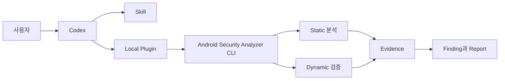

# 전체 구조 한눈에 보기

```mermaid
flowchart LR
    A[사용자] --> B[Codex]
    B --> C[Skill]
    B --> D[Local Plugin]
    D --> E[Android Security Analyzer CLI]
    E --> F[Static 분석]
    E --> G[Dynamic 검증]
    F --> H[Evidence]
    G --> H
    H --> I[Finding과 Report]
```

- 핵심은 Codex가 직접 분석 엔진이 아니라, 설치된 Skill과 CLI를 조율한다는 점이다.
- Static만으로 끝내지 않고 Dynamic까지 수행해 evidence를 확보한다.
