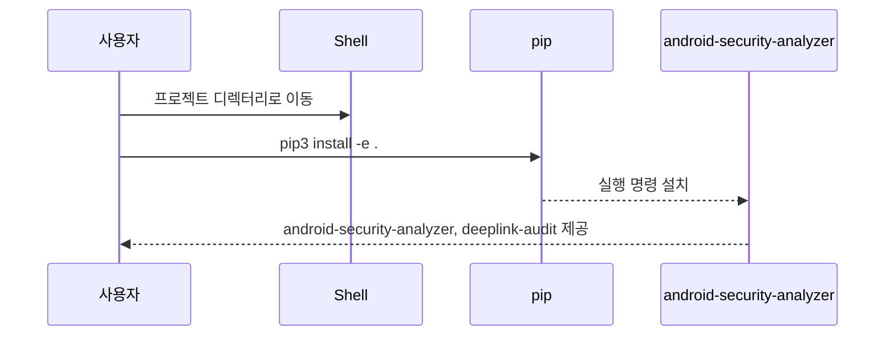

# 설치 단계


```mermaid
sequenceDiagram
    participant User as 사용자
    participant Shell as Shell
    participant Pip as pip
    participant CLI as android-security-analyzer

    User->>Shell: 프로젝트 디렉터리로 이동
    User->>Pip: pip3 install -e .
    Pip-->>CLI: 실행 명령 설치
    CLI-->>User: android-security-analyzer, deeplink-audit 제공
```

```bash
pip3 install -e .
```

설치 후 사용할 수 있는 명령
- `android-security-analyzer`
- `deeplink-audit`
