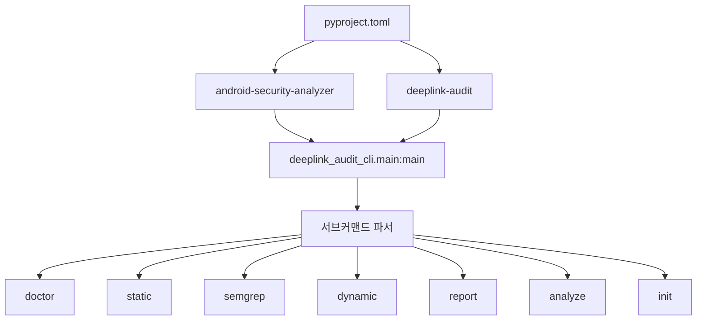

# 엔트리포인트 구조

```mermaid
flowchart TB
    A[pyproject.toml] --> B[android-security-analyzer]
    A --> C[deeplink-audit]
    B --> D[deeplink_audit_cli.main:main]
    C --> D
    D --> E[서브커맨드 파서]
    E --> F[doctor]
    E --> G[static]
    E --> H[semgrep]
    E --> I[dynamic]
    E --> J[report]
    E --> K[analyze]
    E --> L[init]
```

- 이름은 두 개지만 내부 진입점은 하나다.
- 그래서 alias가 달라도 동일한 실행 흐름을 탄다.
