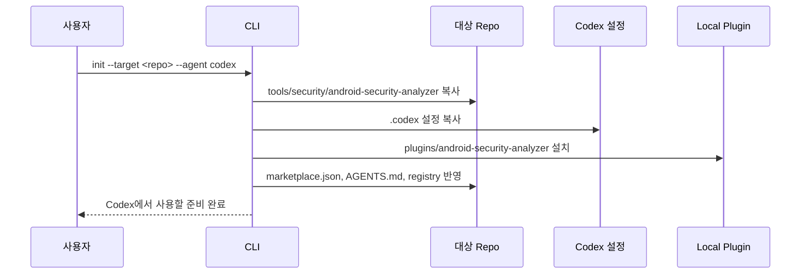

# init 명령의 역할

```mermaid
sequenceDiagram
    participant User as 사용자
    participant CLI as CLI
    participant Repo as 대상 Repo
    participant Codex as Codex 설정
    participant Plugin as Local Plugin

    User->>CLI: init --target <repo> --agent codex
    CLI->>Repo: tools/security/android-security-analyzer 복사
    CLI->>Codex: .codex 설정 복사
    CLI->>Plugin: plugins/android-security-analyzer 설치
    CLI->>Repo: marketplace.json, AGENTS.md, registry 반영
    CLI-->>User: Codex에서 사용할 준비 완료
```

- `init`은 분석을 수행하는 명령이 아니라, 분석을 위한 실행 환경을 repo에 심는 단계다.
