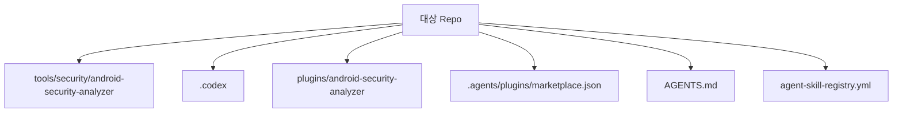

# 대상 repo에 생기는 구조


```mermaid
flowchart TB
    A[대상 Repo] --> B[tools/security/android-security-analyzer]
    A --> C[.codex]
    A --> D[plugins/android-security-analyzer]
    A --> E[.agents/plugins/marketplace.json]
    A --> F[AGENTS.md]
    A --> G[agent-skill-registry.yml]
```

```text
tools/security/android-security-analyzer/
.codex/
plugins/android-security-analyzer/
.agents/plugins/marketplace.json
AGENTS.md
agent-skill-registry.yml
```
