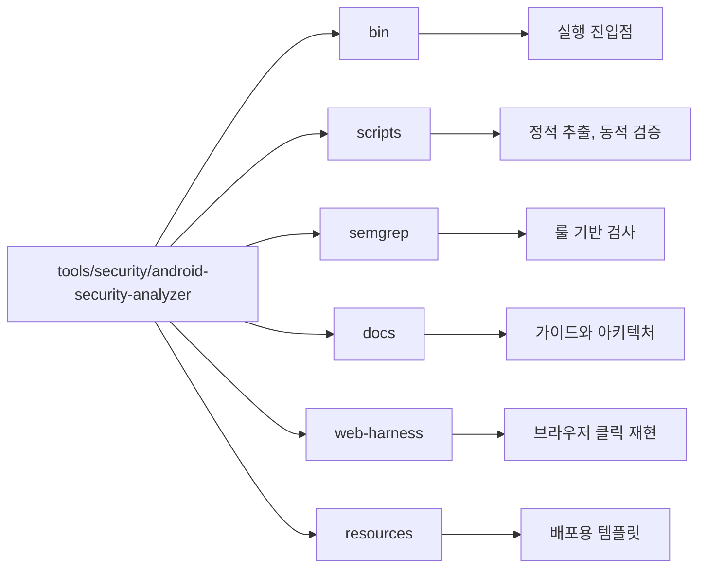

# tools 폴더의 실제 역할

```mermaid
flowchart LR
    A[tools/security/android-security-analyzer] --> B[bin]
    A --> C[scripts]
    A --> D[semgrep]
    A --> E[docs]
    A --> F[web-harness]
    A --> G[resources]

    B --> B1[실행 진입점]
    C --> C1[정적 추출, 동적 검증]
    D --> D1[룰 기반 검사]
    E --> E1[가이드와 아키텍처]
    F --> F1[브라우저 클릭 재현]
    G --> G1[배포용 템플릿]
```

- 이 폴더는 Codex가 간접적으로 쓰는 실제 분석 자산 모음이다.
