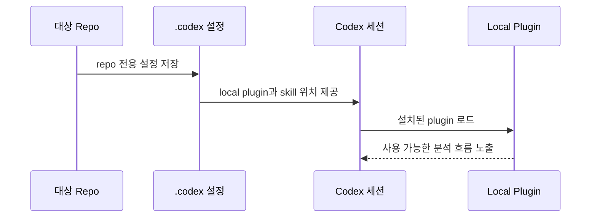

# Codex 설정은 왜 필요한가

```mermaid
sequenceDiagram
    participant Repo as 대상 Repo
    participant Config as .codex 설정
    participant Codex as Codex 세션
    participant Plugin as Local Plugin

    Repo->>Config: repo 전용 설정 저장
    Config->>Codex: local plugin과 skill 위치 제공
    Codex->>Plugin: 설치된 plugin 로드
    Plugin-->>Codex: 사용 가능한 분석 흐름 노출
```

- Codex는 이 설정을 보고 repo별 도구를 인식한다.
- 이 단계가 없으면 일반 파일 편집 세션으로만 동작한다.
