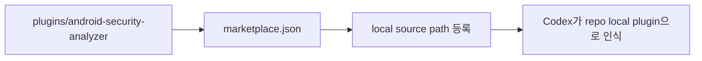

# local plugin 등록 방식

```mermaid
flowchart LR
    A[plugins/android-security-analyzer] --> B[marketplace.json]
    B --> C[local source path 등록]
    C --> D[Codex가 repo local plugin으로 인식]
```

- plugin은 “분석 기능이 여기 있다”는 연결점이다.
- 실제 실행 엔진은 여전히 CLI 쪽에 있다.
