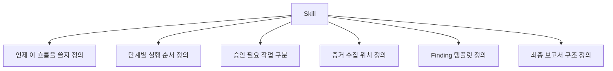

# Skill이 하는 일

구체적으로 Skill에 들어가야 할 내용
- 대상 입력값 형식
- static에서 확인할 항목
- dynamic에서 반드시 검증할 항목
- evidence 저장 규칙
- finding 제목과 severity 형식
- MASVS나 내부 기준 매핑 방식

핵심 메시지
- Skill은 단순 설명문이 아니라, Codex가 따라야 할 감사 절차서다.
