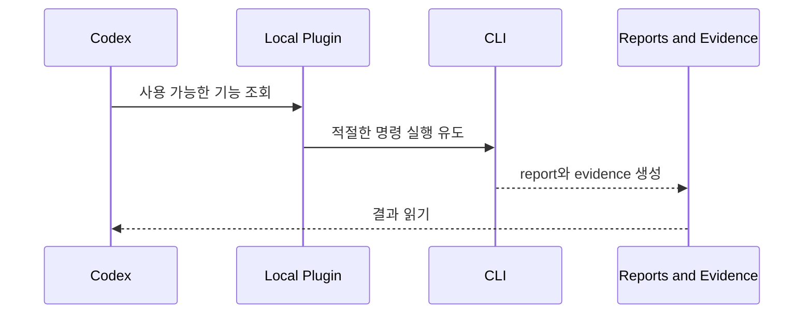

# plugin이 하는 일

```mermaid
sequenceDiagram
    participant Codex as Codex
    participant Plugin as Local Plugin
    participant CLI as CLI
    participant Files as Reports and Evidence

    Codex->>Plugin: 사용 가능한 기능 조회
    Plugin->>CLI: 적절한 명령 실행 유도
    CLI-->>Files: report와 evidence 생성
    Files-->>Codex: 결과 읽기
```

- plugin은 Codex와 CLI 사이의 연결점이다.
- plugin이 분석 로직을 대신 구현하는 것은 아니다.
