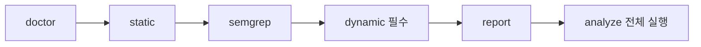

# 실제 분석 엔진은 CLI다

각 단계 설명
- `doctor`: 도구와 환경 준비 상태 확인
- `static`: manifest와 소스에서 딥링크 엔트리 추출
- `semgrep`: validation, sink, 위험 패턴 탐지
- `dynamic`: 실제 호출로 증거 확보, 결과 검증
- `report`: evidence를 묶어 finding과 보고서 생성

중요
- 여기서는 dynamic을 선택 기능이 아니라 필수 evidence 확보 단계로 본다.
