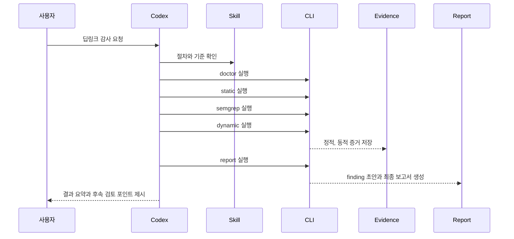

# Codex가 실제로 활용하는 흐름

```mermaid
sequenceDiagram
    participant User as 사용자
    participant Codex as Codex
    participant Skill as Skill
    participant CLI as CLI
    participant Evidence as Evidence
    participant Report as Report

    User->>Codex: 딥링크 감사 요청
    Codex->>Skill: 절차와 기준 확인
    Codex->>CLI: doctor 실행
    Codex->>CLI: static 실행
    Codex->>CLI: semgrep 실행
    Codex->>CLI: dynamic 실행
    CLI-->>Evidence: 정적, 동적 증거 저장
    Codex->>CLI: report 실행
    CLI-->>Report: finding 초안과 최종 보고서 생성
    Codex-->>User: 결과 요약과 후속 검토 포인트 제시
```
