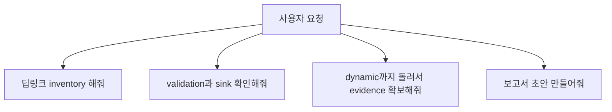

# 사용자는 어떻게 요청하면 좋은가

```mermaid
flowchart TB
    A[사용자 요청] --> B[딥링크 inventory 해줘]
    A --> C[validation과 sink 확인해줘]
    A --> D[dynamic까지 돌려서 evidence 확보해줘]
    A --> E[보고서 초안 만들어줘]
```

권장 요청 방식
- 대상 앱과 범위를 먼저 명시
- dynamic 검증까지 포함한다고 분명히 말하기
- 최종 산출물 형식도 같이 지정하기
