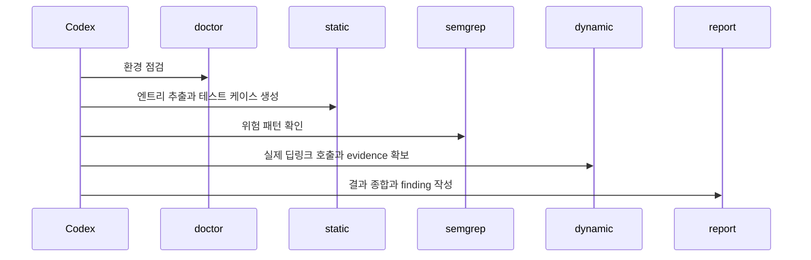

# 권장 실행 흐름

```mermaid
sequenceDiagram
    participant Codex as Codex
    participant Doctor as doctor
    participant Static as static
    participant Semgrep as semgrep
    participant Dynamic as dynamic
    participant Report as report

    Codex->>Doctor: 환경 점검
    Codex->>Static: 엔트리 추출과 테스트 케이스 생성
    Codex->>Semgrep: 위험 패턴 확인
    Codex->>Dynamic: 실제 딥링크 호출과 evidence 확보
    Codex->>Report: 결과 종합과 finding 작성
```

이 흐름을 권장하는 이유
- static만으로는 실제 재현 가능성을 확정하기 어렵다.
- dynamic까지 해야 evidence가 살아난다.
