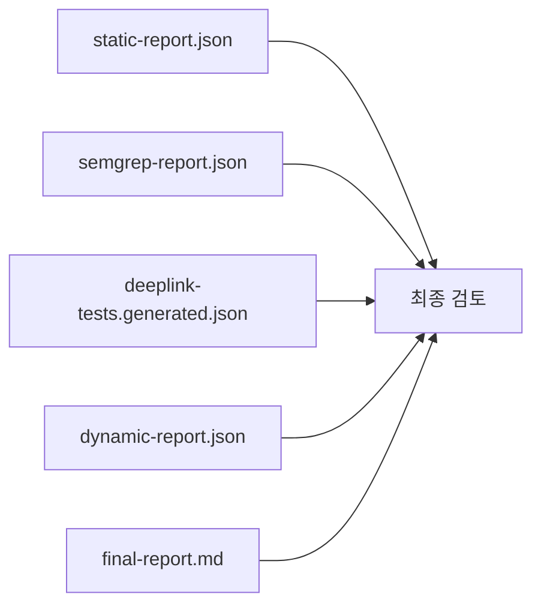

# 주요 산출물과 확인 포인트

각 파일의 의미
- `static-report.json`: 엔트리포인트와 manifest 중심 정적 결과
- `semgrep-report.json`: 코드 패턴과 위험 후보
- `deeplink-tests.generated.json`: dynamic에서 재사용할 테스트 입력
- `dynamic-report.json`: 실제 실행 기반 evidence
- `final-report.md`: 보고서 초안
