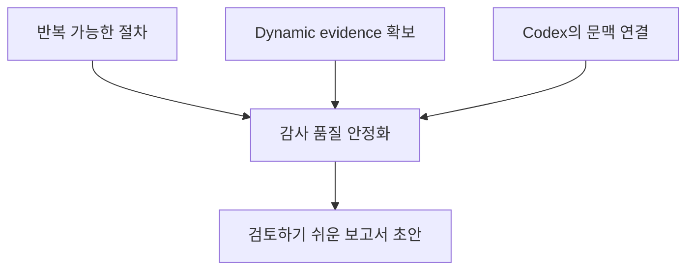

# 사용자가 얻는 실제 가치

```mermaid
flowchart TB
    A[반복 가능한 절차] --> D[감사 품질 안정화]
    B[Dynamic evidence 확보] --> D
    C[Codex의 문맥 연결] --> D
    D --> E[검토하기 쉬운 보고서 초안]
```

- 단순 자동화가 아니라, 증거 기반 감사 흐름을 반복 가능하게 만든다.
