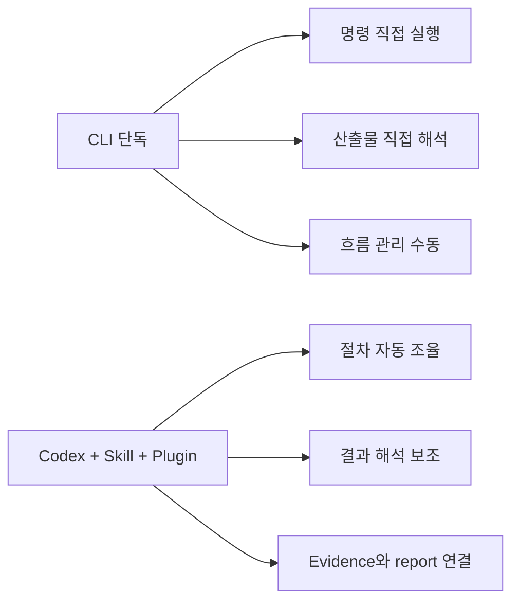

# CLI만 쓸 때와 Codex를 붙였을 때

```mermaid
flowchart LR
    A[CLI 단독] --> A1[명령 직접 실행]
    A --> A2[산출물 직접 해석]
    A --> A3[흐름 관리 수동]

    B[Codex + Skill + Plugin] --> B1[절차 자동 조율]
    B --> B2[결과 해석 보조]
    B --> B3[Evidence와 report 연결]
```

- CLI 단독도 가능하지만, Codex를 붙이면 사람이 흐름을 덜 놓친다.
