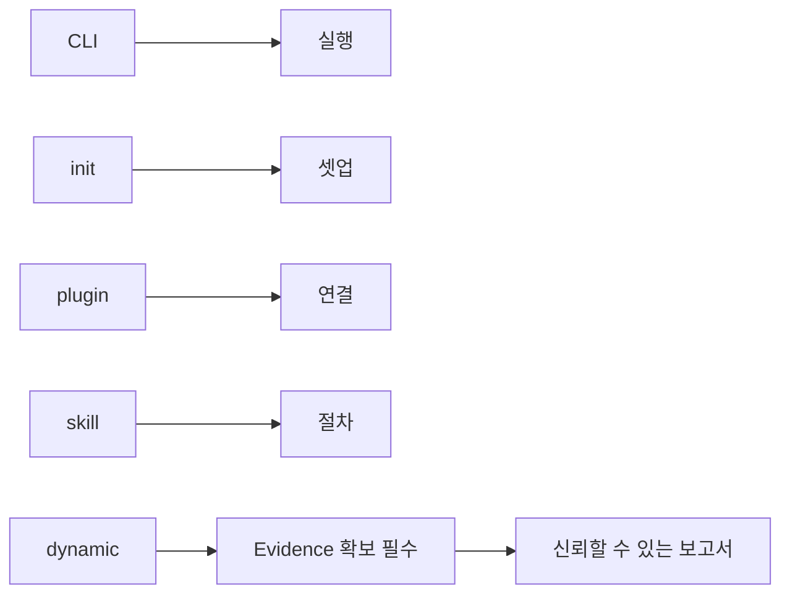

# 결론

```mermaid
flowchart LR
    A[CLI] --> B[실행]
    C[init] --> D[셋업]
    E[plugin] --> F[연결]
    G[skill] --> H[절차]
    I[dynamic] --> J[Evidence 확보 필수]
    J --> K[신뢰할 수 있는 보고서]
```

정리
- CLI는 분석 엔진이다.
- init은 Codex가 그 엔진을 쓰게 만드는 셋업 단계다.
- plugin은 연결점이고, skill은 절차다.
- static만으로 끝내지 않고 dynamic까지 수행해야 evidence를 확보할 수 있다.
