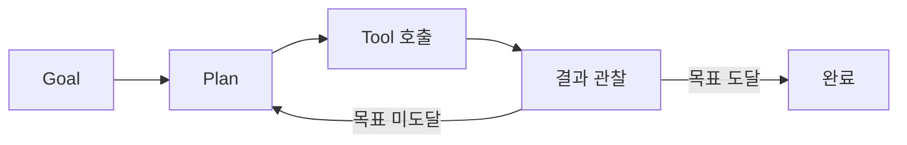

# AI Agent: 일반 LLM과의 차이

| 구분 | 특징 |
|---|---|
| 일반 LLM | 생성과 요약에 강하지만 도구 실행은 못함 |
| AI Agent | 목표 분해, 도구 선택, 결과 해석, 다음 행동 결정 |

핵심: LLM에 *도구 호출 + 루프* 가 결합된 구조

- 명령어 변환기
- 분석 보조자
- 증거 관리자
- 보고서 작성자
