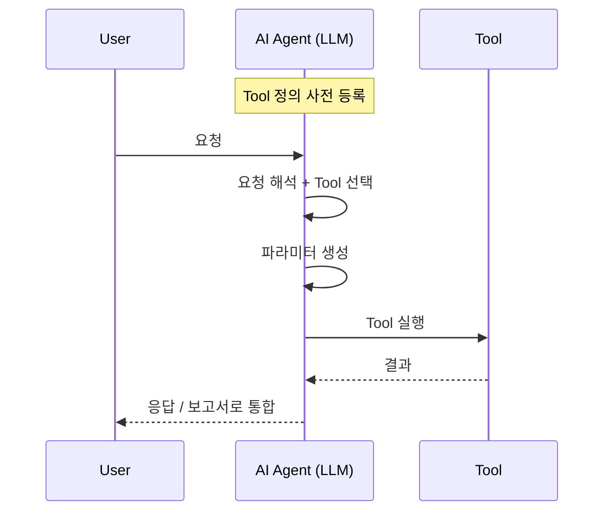

# Tool Calling: 모델이 도구를 호출하는 방식



1. Tool 정의 등록
2. 사용자 요청 해석
3. 실행할 Tool 선택
4. 파라미터 생성
5. Tool 실행
6. 결과 수신
7. 보고서나 요약으로 통합

```json
{
  "tool": "get_device_info",
  "arguments": {"device_id": "R5CR123ABC4"}
}
```
