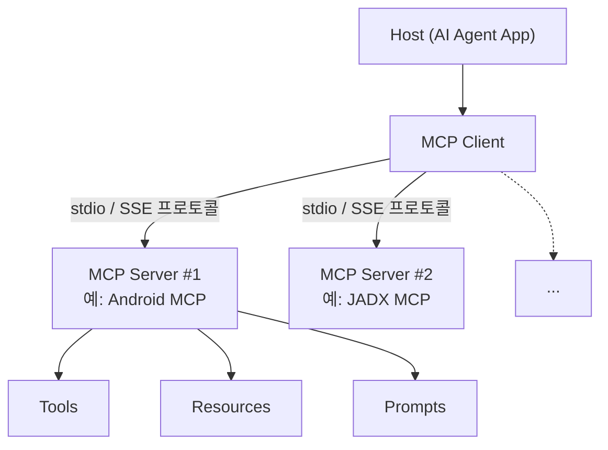

# MCP: Host / Client / Server 3층 구조

- **Host**: AI Agent를 실행하는 앱 (Claude Code, Codex 등)
- **MCP Client**: Host 안에서 서버와 표준 프로토콜로 통신
- **MCP Server**: 도구 묶음을 노출 — Tools / Resources / Prompts
- Client 1개에 Server N개 연결 가능

MCP는 AI 애플리케이션과 외부 도구를 연결하는 표준 프로토콜이다.
