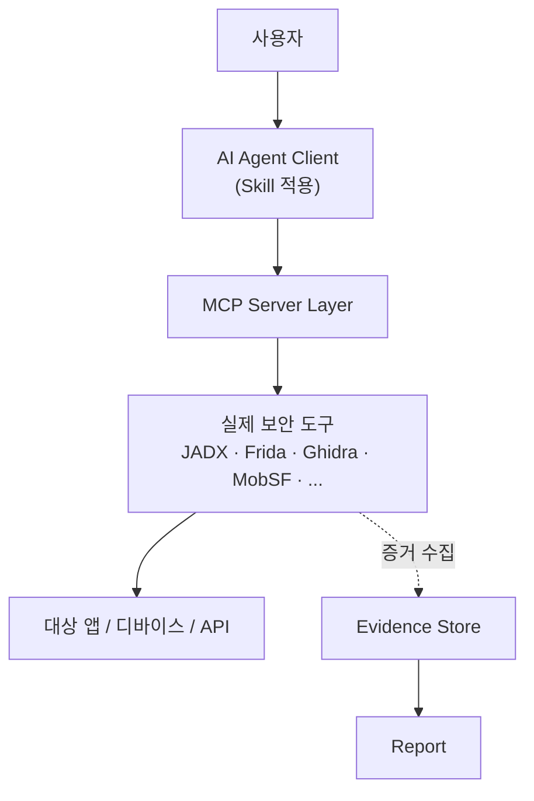

# 전체 감사 아키텍처

```mermaid
flowchart TB
    U[사용자]
    A["AI Agent Client<br>(Skill 적용)"]
    M[MCP Server Layer]
    T["실제 보안 도구<br>JADX · Frida · Ghidra · MobSF · ..."]
    Tg[대상 앱 / 디바이스 / API]
    E[Evidence Store]
    R[Report]

    U --> A --> M --> T --> Tg
    T -.->|"증거 수집"| E
    E --> R
```

- 사용자는 Agent에게 감사 요청
- Skill이 절차를 표준화, MCP Server Layer가 도구를 노출
- 도구는 실제 대상에 작동, 결과를 Evidence Store로 모음
- Report가 최종 산출물
