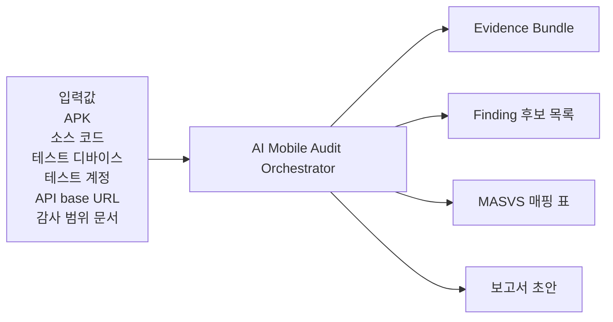

# 감사 시스템: Mobile Audit Orchestrator 개요

```mermaid
flowchart LR
    A[입력값\nAPK\n소스 코드\n테스트 디바이스\n테스트 계정\nAPI base URL\n감사 범위 문서] --> B[AI Mobile Audit Orchestrator]
    B --> C[Evidence Bundle]
    B --> D[Finding 후보 목록]
    B --> E[MASVS 매핑 표]
    B --> F[보고서 초안]
```

입력값
- APK
- 소스 코드 저장소
- 테스트 디바이스
- 테스트 계정
- API base URL
- 감사 범위 문서

출력값
- Evidence Bundle
- Finding 후보 목록
- MASVS 매핑 표
- 보고서 초안
