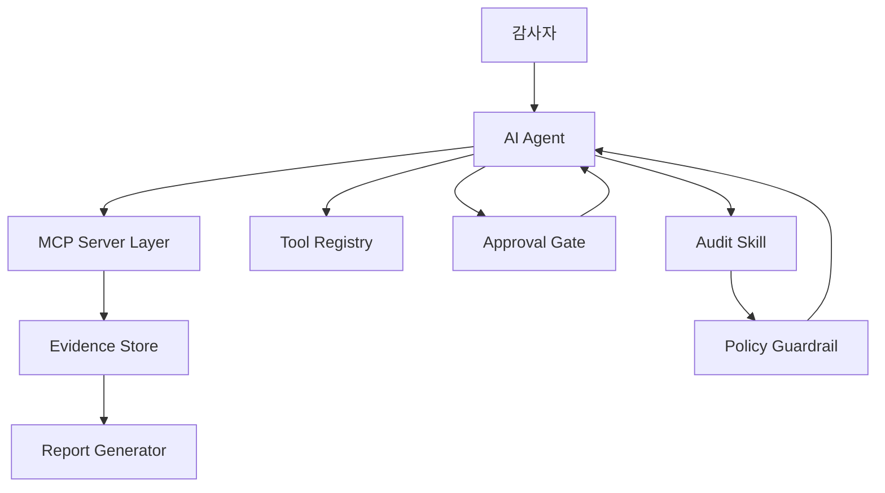

# 감사 시스템: 컴포넌트 구성

```mermaid
flowchart TB
    U[감사자] --> A[AI Agent]
    A --> S[Audit Skill]
    A --> T[Tool Registry]
    A --> G[Approval Gate]
    A --> M[MCP Server Layer]
    M --> E[Evidence Store]
    E --> R[Report Generator]
    S --> P[Policy Guardrail]
    P --> A
    G --> A
```

- AI Agent
- Audit Skill
- Tool Registry
- Approval Gate
- MCP Server Layer
- Evidence Store
- Report Generator
- Policy Guardrail
