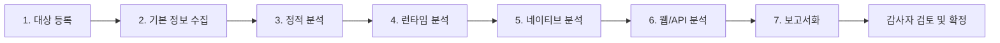

# 감사 시스템: 단계별 실행 흐름

```mermaid
flowchart LR
    A[1. 대상 등록] --> B[2. 기본 정보 수집]
    B --> C[3. 정적 분석]
    C --> D[4. 런타임 분석]
    D --> E[5. 네이티브 분석]
    E --> F[6. 웹/API 분석]
    F --> G[7. 보고서화]
    G --> H[감사자 검토 및 확정]
```

1. 대상 등록
2. 기본 정보 수집
3. 정적 분석
4. 런타임 분석
5. 네이티브 분석
6. 웹/API 분석
7. 보고서화

원칙: 먼저 자동 수집, 이후 사람이 검토
