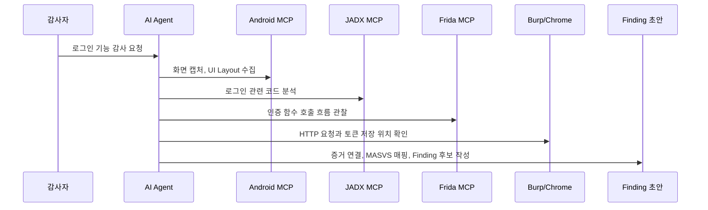

# 감사 시스템: 로그인 기능 감사 시나리오

```mermaid
sequenceDiagram
    participant Auditor as 감사자
    participant Agent as AI Agent
    participant Android as Android MCP
    participant JADX as JADX MCP
    participant Frida as Frida MCP
    participant Net as Burp/Chrome
    participant Report as Finding 초안

    Auditor->>Agent: 로그인 기능 감사 요청
    Agent->>Android: 화면 캡처, UI Layout 수집
    Agent->>JADX: 로그인 관련 코드 분석
    Agent->>Frida: 인증 함수 호출 흐름 관찰
    Agent->>Net: HTTP 요청과 토큰 저장 위치 확인
    Agent->>Report: 증거 연결, MASVS 매핑, Finding 후보 작성
```

- 화면 캡처와 UI Layout 수집
- 로그인 관련 코드 분석
- 인증 함수 호출 흐름 관찰
- HTTP 요청 확인
- 토큰 저장 위치 확인
- MASVS 기준으로 매핑
