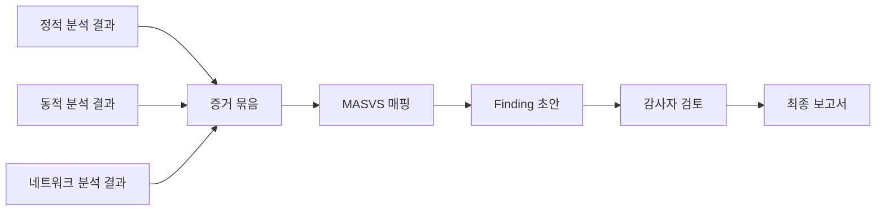

# 감사 시스템: Finding 생성 예시


```mermaid
flowchart LR
    A[정적 분석 결과] --> D[증거 묶음]
    B[동적 분석 결과] --> D
    C[네트워크 분석 결과] --> D
    D --> E[MASVS 매핑]
    E --> F[Finding 초안]
    F --> G[감사자 검토]
    G --> H[최종 보고서]
```

```markdown
# Finding: 제목
## 요약
## 영향도
## 영향 범위
## 재현 절차
## 증거
## 기준 매핑
## 권고 조치
## 검증 방법
```
