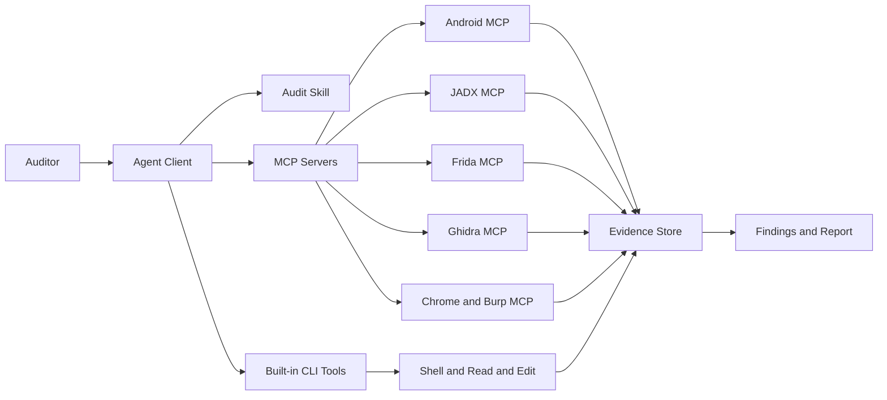

# 4. 전체 아키텍처

---
class: diagram-slide
---

# AI 기반 모바일 감사 구조

---

# 왜 이 구조가 필요한가

- 모바일 앱 감사는 단일 도구로 끝나지 않는다
- 정적 분석, 동적 분석, 네트워크 분석, 네이티브 분석이 연결되어야 한다
- 결과를 한 번에 보고서로 만들려면 증거 저장 구조가 먼저 있어야 한다
- Agent는 여러 결과를 이어 붙여 Finding 후보를 만드는 데 강하다
