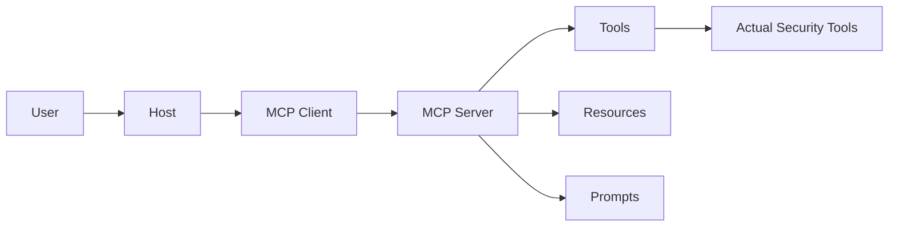

# 5. MCP의 구조

---
class: diagram-slide
---

# MCP 아키텍처

---

# MCP 구성 요소

- Host: Claude Desktop, Claude Code, Codex CLI, Cursor 등
- MCP Client: Host 안에서 Server와 통신
- MCP Server: 도구 기능을 표준 인터페이스로 노출
- Tool: 실행 함수
- Resource: 참고 데이터
- Prompt: 반복 작업용 템플릿

MCP는 AI용 연결 규격이다. 여러 도구를 일관된 방식으로 붙이게 해준다.

