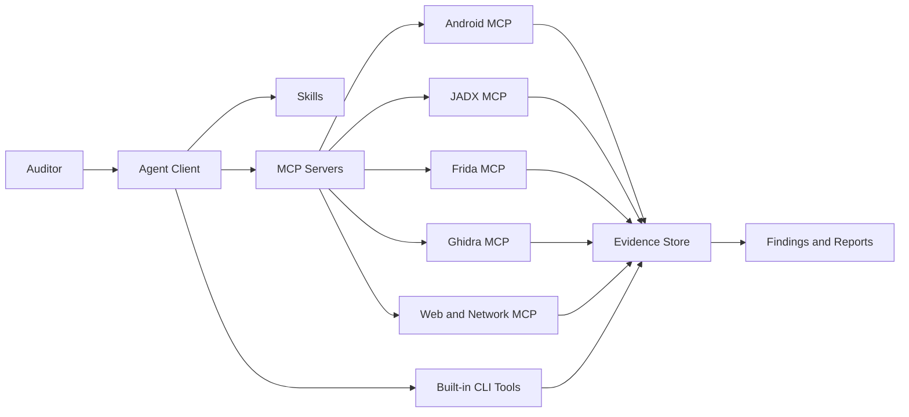

# 12. 전체 감사 도구체인 아키텍처

---
class: diagram-slide
---

# 전체 구조

```mermaid
flowchart LR
    U[Auditor] --> A[Agent Client]
    A --> SK[Skills]
    A --> MS[MCP Servers]
    A --> BI[Built-in CLI Tools]
    MS --> AM[Android MCP]
    MS --> JM[JADX MCP]
    MS --> FM[Frida MCP]
    MS --> GM[Ghidra MCP]
    MS --> WM[Web and Network MCP]
    AM --> E[Evidence Store]
    JM --> E
    FM --> E
    GM --> E
    WM --> E
    BI --> E
    E --> R[Findings and Reports]
```

---

# 핵심 원칙

- 모든 결과는 evidence 경로에 모은다
- 단계별로 필요한 서버만 켠다
- Agent는 조율자이지 최종 판단자가 아니다
