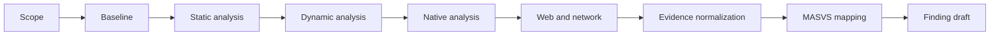

# 27. AI Mobile Audit Orchestrator

---
class: diagram-slide
---

# 단계별 실행 흐름

```mermaid
flowchart LR
    S[Scope] --> B[Baseline]
    B --> ST[Static analysis]
    ST --> DY[Dynamic analysis]
    DY --> NA[Native analysis]
    NA --> NW[Web and network]
    NW --> EV[Evidence normalization]
    EV --> MA[MASVS mapping]
    MA --> FD[Finding draft]
```

---

# 목표

- 도구 결과를 하나의 감사 컨텍스트로 묶는다
- 반복 수집 작업을 표준화한다
- MASVS 기준의 Finding 초안을 만든다
- 사람의 최종 판단을 남긴다
