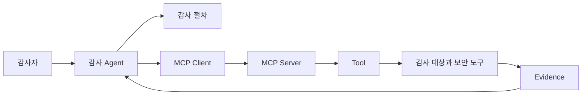

# 2. Agent · MCP · Tool · Skill

---

# 개념을 섞지 않고 보는 것이 중요하다

| 계층 | 역할 | 예시 |
|---|---|---|
| Agent | 목표 해석, 절차 선택, 결과 요약 | Claude Code, Codex CLI, Cursor |
| MCP | Client와 Server를 잇는 연결 규격 | JSON-RPC 기반 프로토콜 |
| MCP Server | 여러 Tool을 묶어 노출하는 서버 | Android MCP, Frida MCP |
| Tool | 실제 실행 단위 | `get_screenshot`, `run_script` |
| Skill | 절차와 판단 기준을 담은 플레이북 | Mobile Audit Skill |

---
class: diagram-slide
---

# 관계 구조

---

# 핵심 구분

- MCP는 외부 도구를 연결하는 방식이다
- Tool은 실제로 실행되는 함수다
- Skill은 어떤 순서로 무엇을 검증할지 정하는 절차다
- Agent는 결과를 읽고 다음 행동을 정하는 조정자다

표현도 이렇게 맞추는 편이 정확하다. 
<b>"MCP로 스크린샷을 찍는다"</b> 보다는 
<b>"Android MCP Server의 스크린샷 Tool을 호출한다"</b>

