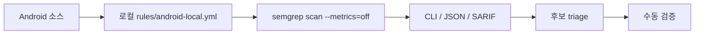
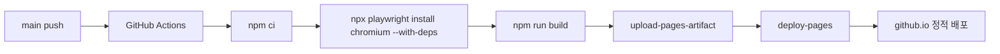

# Semgrep CE Android 로컬 룰 점검

Registry 없이, Pro 없이, 로컬 rule pack만으로 Android 보안 후보를 추출하는 운영 방식을 정리합니다.

---

# 범위와 제외 조건

- 사용 범위: `Semgrep Community Edition CLI` + 직접 작성한 로컬 YAML 룰
- 대상 언어: Java, Kotlin, Manifest/Gradle 설정 탐색
- 제외 범위: `p/java`, `p/kotlin`, `p/default`, Registry, 외부 rule pack, AppSec Platform/Pro
- 라이선스 메모: CE 엔진은 `LGPL 2.1`, `semgrep-rules` 저장소 룰은 별도 라이선스라 이번 범위에 포함하지 않음

---

# 운영 원칙



- 완전 로컬 운용에 가깝게 가져가려면 `--metrics=off`를 기본값처럼 사용
- `semgrep ci`보다 `semgrep scan`이 로컬 테스트와 커스텀 룰 검증에 적합

---

# 설치

```bash
# macOS
brew install semgrep
semgrep --version

# Python 환경
python3 -m pip install --upgrade semgrep
semgrep --version

# Docker
docker pull semgrep/semgrep
docker run --rm semgrep/semgrep semgrep --version
```

---

# 권장 디렉터리 구조

```text
android-project/
├── app/
│   ├── build.gradle.kts
│   └── src/main/
│       ├── AndroidManifest.xml
│       ├── java/...
│       └── kotlin/...
├── rules/
│   └── android-local.yml
└── .semgrepignore
```

- 제외 권장: `build/`, `.gradle/`, `generated/`, `src/test/`, `src/androidTest/`
- 대용량 리소스나 산출물은 `.semgrepignore`로 빼서 노이즈와 시간을 줄임

---

# 기본 실행

```bash
# 전체 프로젝트
semgrep scan --metrics=off --config rules/android-local.yml .

# app/src/main만
semgrep scan --metrics=off --config rules/android-local.yml app/src/main

# Java/Kotlin만
semgrep scan --metrics=off \
  --config rules/android-local.yml \
  --include='**/*.java' \
  --include='**/*.kt' \
  app/src/main
```

---

# 결과 저장과 ad-hoc 검색

```bash
# JSON / SARIF
semgrep scan --metrics=off --config rules/android-local.yml \
  --json --output semgrep-android.json .

semgrep scan --metrics=off --config rules/android-local.yml \
  --sarif --output semgrep-android.sarif .

# grep처럼 한 번만 검색
semgrep scan --metrics=off --lang java \
  -e '$W.loadUrl($URL)' app/src/main/java

semgrep scan --metrics=off --lang kotlin \
  -e 'Runtime.getRuntime().exec($CMD)' app/src/main/kotlin
```

---

# 룰 작성 모델

- Semgrep pattern은 정규식이 아니라 언어의 코드 모양을 기준으로 매칭
- `...` 는 0개 이상의 인자, statement, field를 추상화
- `$URL`, `$DB`, `$CMD` 같은 metavariable은 임의 코드 조각을 바인딩

```yaml
pattern: ...              # 단일 패턴
patterns: ...             # AND
pattern-either: ...       # OR
pattern-not: ...          # 제외
pattern-inside: ...       # 특정 블록 내부
pattern-not-inside: ...   # 특정 블록 내부는 제외
metavariable-regex: ...   # metavariable 값 정규식 필터
metavariable-pattern: ... # metavariable 내부를 다시 패턴으로 필터링
```

---

# 로컬 룰팩 설계 포인트

- WebView: JavaScript 활성화 + `addJavascriptInterface`
- Taint: `Intent / Uri / EditText -> WebView.loadUrl`
- Taint: 외부 입력 -> `SQLite rawQuery / execSQL`
- Taint: 외부 입력 -> `Runtime.exec / ProcessBuilder`
- Pattern: trust-all `TrustManager`, `HostnameVerifier { true }`
- Pattern: `Cipher.getInstance("AES/ECB/...")`, static IV
- Generic: `AndroidManifest.xml`, `build.gradle(.kts)` 설정 탐색

---

# WebView + taint 룰 예시

```yaml
- id: android.webview.javascript-interface.kotlin
  languages: [kotlin]
  patterns:
    - pattern-either:
        - pattern: |
            $W.settings.javaScriptEnabled = true
            ...
            $W.addJavascriptInterface($OBJ, $NAME)

- id: android.intent-data-to-webview-loadurl.java
  mode: taint
  pattern-sources:
    - pattern-either:
        - pattern: getIntent().getDataString()
        - pattern: getIntent().getStringExtra(...)
  pattern-sinks:
    - pattern: $WEBVIEW.loadUrl($URL)
```

- Android 리뷰에서는 같은 함수 내부 직접 흐름을 먼저 잡고, 이후 false positive를 줄이는 방식이 현실적

---

# Java 예제

```java
WebSettings settings = webView.getSettings();
settings.setJavaScriptEnabled(true);
webView.addJavascriptInterface(new NativeBridge(), "NativeBridge");

String deepLink = getIntent().getDataString();
String fallback = getIntent().getStringExtra("next");
String url = deepLink != null ? deepLink : fallback;
webView.loadUrl(url);

String keyword = searchBox.getText().toString();
String sql = "SELECT * FROM users WHERE name = '" + keyword + "'";
db.rawQuery(sql, null);
```

- 위 한 함수에서 WebView bridge, Intent -> `loadUrl`, EditText -> SQL 흐름을 동시에 확인 가능

---

# Kotlin, Manifest, Gradle 예제 포인트

```kotlin
webView.settings.javaScriptEnabled = true
webView.addJavascriptInterface(KotlinBridge(), "Bridge")
val finalUrl = intent.dataString ?: intent.getStringExtra("redirect")
webView.loadUrl(finalUrl)
ProcessBuilder(intent.getStringExtra("cmd") ?: "id").start()
val verifier = HostnameVerifier { _, _ -> true }
```

```text
AndroidManifest.xml
- android:usesCleartextTraffic="true"
- exported="true" 이지만 permission 없음

build.gradle.kts
- release { isDebuggable = true }
```

- XML은 parser 정밀도보다 `generic + pattern-regex` 조합이 실무적으로 더 단순한 경우가 많음

---

# 룰 테스트와 회귀 검증

```java
// ruleid: android.webview.javascript-interface.java
webView.getSettings().setJavaScriptEnabled(true);
webView.addJavascriptInterface(new Object(), "Bridge");

// ok: android.webview.javascript-interface.java
webView.loadUrl("https://example.com");
```

```bash
semgrep --test --metrics=off --config rules/android-local.yml rules/
semgrep scan --metrics=off --config rules/android-local.yml test-fixtures/
semgrep scan --metrics=off --config rules/android-local.yml app/src/main
```

---

# 실무 튜닝 포인트

- 첫 단계는 정답 탐지기가 아니라 후보 추출기라고 생각하는 편이 안전
- `taint`는 `Intent / Bundle / Uri / EditText -> sink` 계열에 먼저 적용
- `pattern`은 TLS 우회, 약한 crypto, cleartext traffic, release debuggable 탐지에 적합
- CE의 Java/Kotlin taint는 단일 파일, 단일 함수 범위 해석에 가깝기 때문에 cross-file lifecycle은 보수적으로 봐야 함
- field 저장, wrapper, DI, service binding 흐름은 보조 룰과 수동 리뷰를 결합

---

# GitHub Pages publish 흐름



- 이 저장소는 `dist/`를 artifact로 올리고 `GitHub Pages`로 바로 배포
- deck별 URL은 `/{repository}/{deck-name}/` 형태로 분리됨

---

# Takeaways

- Semgrep CE만으로도 Android 코드와 설정에서 빠른 후보 추출이 가능
- 외부 룰을 배제하면 재현성과 라이선스 경계가 명확해짐
- 로컬 룰팩, annotation 테스트, JSON/SARIF 저장을 묶으면 운영이 안정적
- GitHub Actions + GitHub Pages 조합으로 발표 자료도 정적 배포 가능
