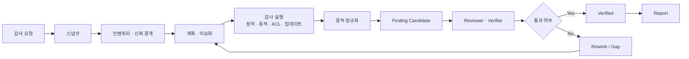

# 3. 감사 작업 구조

---
class: diagram-slide
---

# 전체 감사 흐름

---

# 작업 단계별 산출물

| 단계 | 담당 | 주요 산출물 |
|---|---|---|
| 프로젝트 현황 파악 | Coordinator, Project Mapper | `docs/status/01_project_snapshot.md` |
| 자산 인벤토리 | Binary Inventory | `docs/evidence/<run-id>/normalized/inventory.csv` |
| 신뢰경계 정리 | Coordinator, Project Mapper | `docs/scope/trust_boundaries.md` |
| 계획 수립 | Coordinator | `docs/plans/active/*.md` |
| 체크리스트 실행 | Auditors | raw evidence, normalized summary, finding candidate |
| 검증 | Reviewer, Verifier | review note, verification result |
| 보고 | Report Writer | weekly report, final report |
