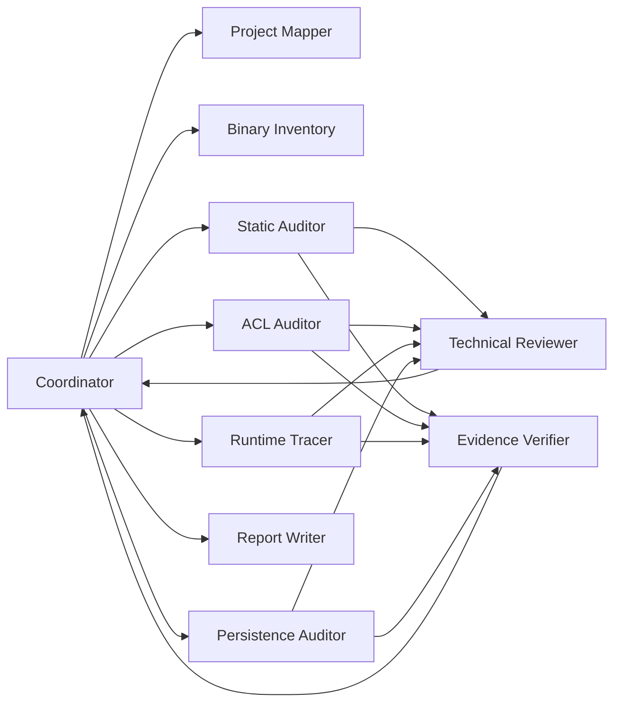

# 4. 에이전트 관계도

---

# Coordinator 중심 구조

---

# 역할 분리

| Agent | 책임 | 금지/제한 |
|---|---|---|
| Coordinator | 계획, 분배, 병합, 상태 확정 | 직접 취약점 판정 금지 |
| Project Mapper | 구조 파악, 신뢰경계 초안 | finding 생성 금지 |
| Binary Inventory | 바이너리/서비스/작업 식별 | 위험도 판정 금지 |
| Static Auditor | 정적 분석과 후보 finding | 최종 확정 금지 |
| ACL Auditor | ACL/권한 경계 분석 | 자기 도메인 밖 결론 금지 |
| Runtime Tracer | 실행·업데이트·행위 추적 | 코드 수정 금지 |
| Persistence Auditor | 자동실행/설치/업데이트 표면 | 최종 보고 반영 금지 |
| Reviewer | 논리·영향·악용 가능성 검토 | raw tool 실행 최소화 |
| Verifier | 증거·재현·경로·버전 검증 | severity 단독 결정 금지 |
| Report Writer | Verified만 보고서화 | 미검증 finding 포함 금지 |
