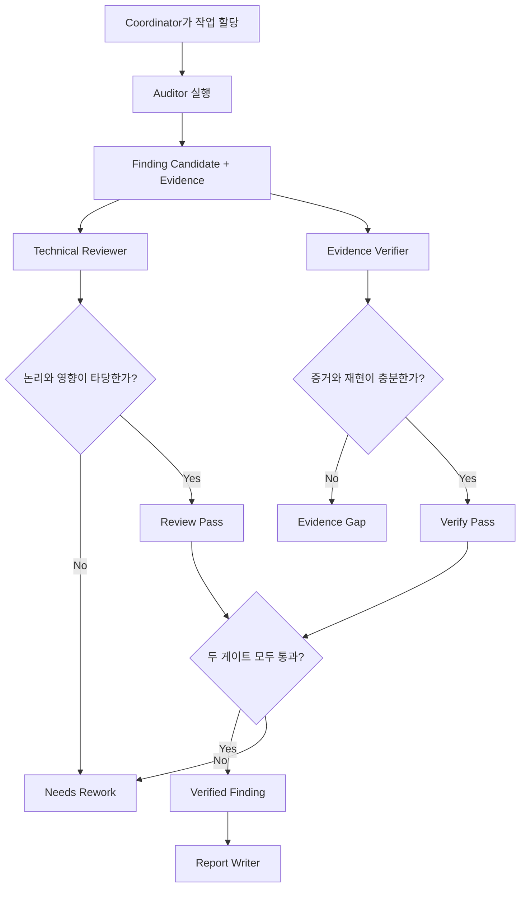
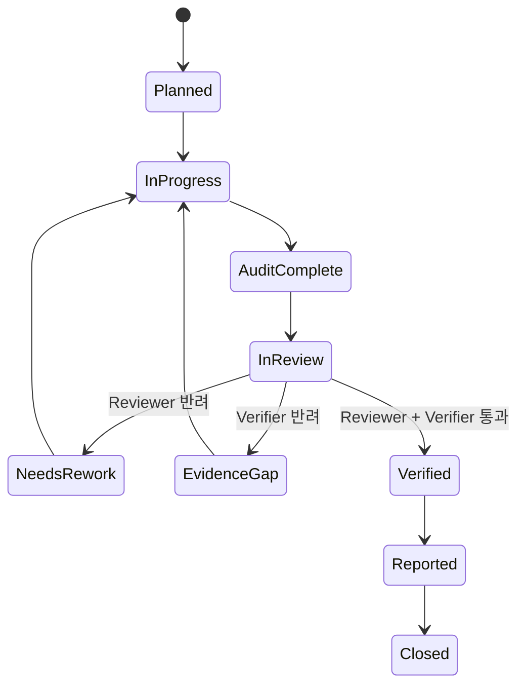

# 5. Reviewer / Verifier 게이트

---

# 승인 흐름

---

# Reviewer와 Verifier를 분리하는 이유

## Reviewer

검토 대상:

- 결론의 보안 논리
- 영향 범위
- 악용 가능성
- severity 과장 여부
- remediation 타당성

## Verifier

검토 대상:

- raw evidence 존재 여부
- 경로, 버전, 자산 식별 정확성
- 재현 절차 완결성
- 도구 출력과 주장 연결성
- 문서/OS 동작과의 충돌 여부

<b>규칙:</b> Reviewer와 Verifier가 모두 통과한 항목만 Verified Finding으로 승격합니다.

---

# 상태 머신

