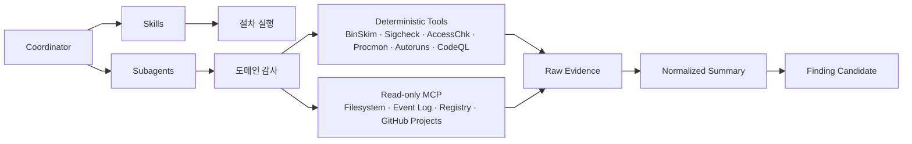

# 8. Tool / MCP 계층

---
class: diagram-slide
---

# 도구 계층 구분

---

# Windows 감사 도구 매핑

| 영역 | 도구 | 목적 |
|---|---|---|
| Binary hardening | BinSkim | ASLR/DEP/CFG 등 컴파일·링커 보안 설정 확인 |
| Signing | Sigcheck | Authenticode, timestamp, certificate chain 확인 |
| ACL / 권한 | AccessChk | 파일, 레지스트리, 서비스, 오브젝트 권한 확인 |
| Runtime behavior | Procmon | 파일/레지스트리/프로세스/스레드 활동 추적 |
| Persistence | Autoruns | 자동 시작 위치, 서비스, scheduled task 등 확인 |
| Source analysis | CodeQL | 코드 기반 취약점 variant 탐색 |

---

# MCP 사용 원칙

- 기본은 read-only
- allowlist 기반 tool exposure
- 실행형 PowerShell은 별도 승인
- code editing agent와 host inspection MCP 분리
- tool call audit log 유지
- raw output과 LLM 결론 분리
- 운영 호스트보다 격리 VM 우선
