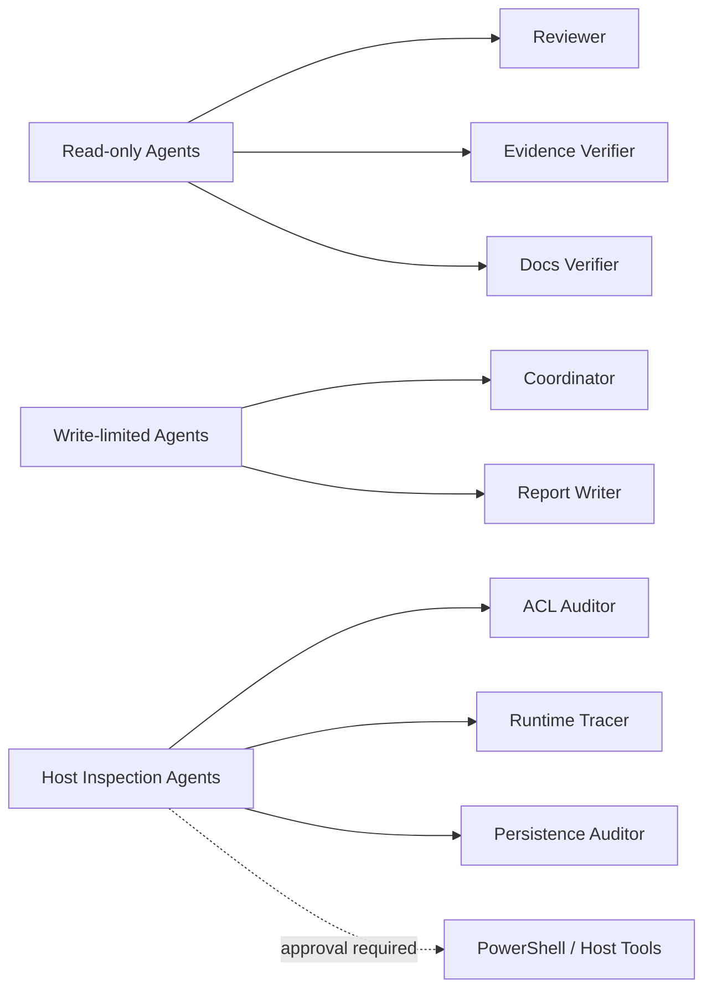

# 9. 에이전트와 MCP 보안 통제

---

# 주요 위험

| 위험 | 설명 | 완화 |
|---|---|---|
| Prompt injection | 외부 문서/로그가 agent 지시를 오염 | tool result를 명령으로 해석 금지 |
| Tool misuse | 에이전트가 과도한 권한 도구 실행 | read-only allowlist, approval gate |
| Evidence contamination | raw evidence와 요약이 뒤섞임 | raw/normalized 분리 |
| False positive | LLM이 그럴듯한 결론 생성 | reviewer/verifier 이중 게이트 |
| Exfiltration | 민감 파일/토큰 노출 | path allowlist, network 제한 |
| Irreversible action | 삭제/수정/실행으로 환경 훼손 | 격리 VM, snapshot, explicit approval |

---

# 권한 모델

Reviewer와 Verifier는 가능한 한 read-only로 유지합니다. 실행형 도구는 감사 수행 agent에만 제한적으로 제공합니다.

