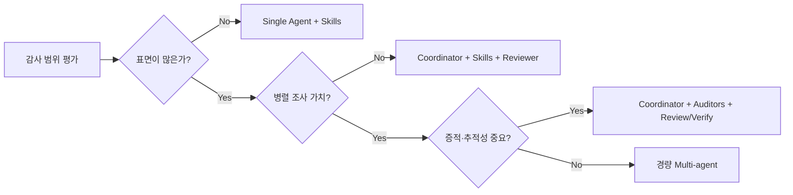

# 11. 다른 구조가 더 적합한 경우

---

# 현재 구조가 특히 잘 맞는 조건

- 감사 범위가 넓음
- installer / updater / service / IPC / ACL / runtime이 모두 포함됨
- 병렬 조사 가치가 높음
- 증적 저장과 나중 검토가 중요함
- GitHub 기반 협업을 사용함
- 에이전트가 읽을 문서와 체크리스트를 저장소에 유지할 수 있음

---

# 대안 비교

| 대안 | 더 나은 경우 | 단점 |
|---|---|---|
| Single agent + skills + reviewer | 범위가 작고 병렬성이 낮음 | 복잡한 감사에서는 컨텍스트 혼잡이 커짐 |
| Custom workflow / orchestrator-worker | 규제·감사상 상태기계가 필요함 | 구현과 유지보수 비용이 증가 |
| Repo-centric scanner 보강 | 코드 저장소 중심 취약점 탐지가 핵심 | runtime/host inspection 커버리지가 약함 |
| Full multi-agent | 병렬 분석이 많고 도메인이 명확히 분리됨 | 비용, 지연, 조정 복잡도가 증가 |

---
class: diagram-slide
---

# 설계 선택 기준

