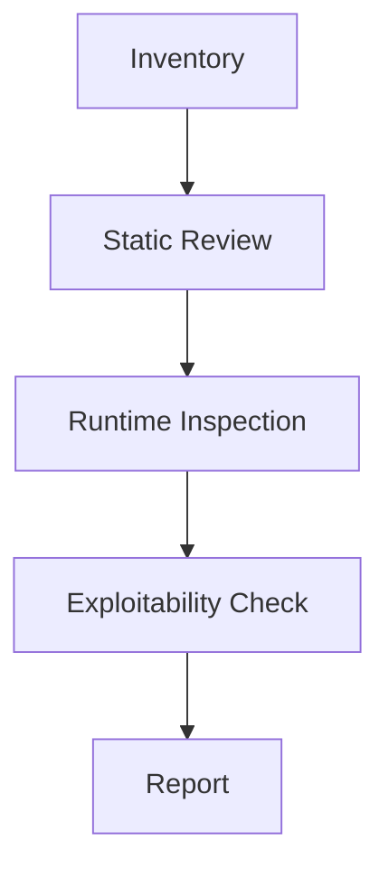

src: ../../global.css
---

---

# Windows Application Security Audit

Windows 애플리케이션 보안 감사 절차를 정리합니다.

---

# 주요 점검 영역

- 설치 경로 권한
- DLL search order
- IPC / named pipe
- 업데이트 체인
- 로그와 민감정보
- 코드 서명
- 로컬 권한 상승 가능성

---

# 감사 흐름

